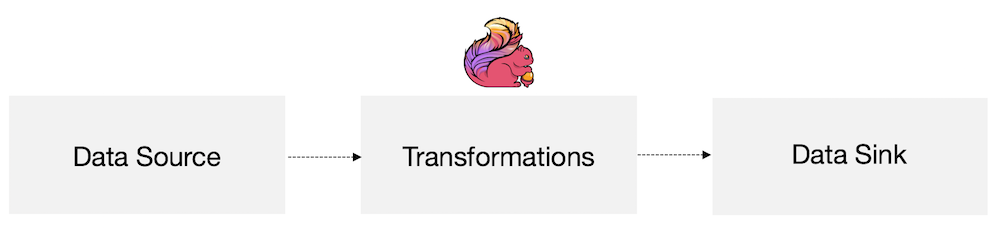

# Apache Flink Training

[Apache Flink®](https://flink.apache.org/) is an open source platform for scalable stream and batch data processing. It offers expressive APIs to define batch and streaming data flow programs and a robust and scalable engine to execute these jobs.

##  Goals and Scope of this Training

This training presents an opinionated introduction to Apache Flink, including just enough to get you started writing scalable streaming ETL, analytics, and event-driven applications, while leaving out a lot of (ultimately important) details. The focus is on providing straightforward introductions to Flink’s APIs for managing state and time, with the expectation that having mastered these fundamentals, you’ll be much better equipped to pick up the rest of what you need to know from the documentation.

Specifically, you will learn:

- how to set up an environment to develop Flink programs
- how to implement streaming data processing pipelines
- how and why Flink manages state
- how to use event time to consistently compute accurate analytics
- how to build event-driven applications on continuous streams
- how Flink is able to provide fault-tolerant, stateful stream processing with exactly-once semantics

[Get Started](https://training.ververica.com/javascript_required.html)


# [A.Intro to Streaming](https://training.ververica.com/intro/intro-1.html#collapse-2)


## A.1Streaming with Apache Flink

During this training we are going to focus on four critical concepts: continuous processing of streaming data, event time, stateful stream processing, and state snapshots. In this section we introduce these concepts.

###  Stream Processing

Streams are data’s natural habitat. Whether it’s events from web servers, trades from a stock exchange, or sensor readings from a machine on a factory floor, data is created as part of a stream. But when we analyze data, we can either organize our processing around *bounded* or *unbounded* streams, and which of these paradigms we choose has profound consequences.


**Batch processing** is the paradigm at work when we process a bounded data stream. In this mode of operation we can choose to ingest the entire dataset before producing any results, which means that it’s possible, for example, to sort the data, compute global statistics, or produce a final report that summarizes all of the input.

**Stream processing**, on the other hand, involves unbounded data streams. Conceptually, at least, the input may never end, and so we are forced to continuously process the data as it arrives.

In Flink, applications are composed of flows of data that may be transformed by user-defined operators. These dataflows form directed graphs that start with one or more sources, and end in one or more sinks.



An application may consume real-time data from streaming sources such as message queues or distributed logs, such as Apache Kafka or Kinesis. But flink can also consume bounded, historic data from a variety of data sources. Similarly, the streams of results being produced by a Flink application can be sent to a wide variety of systems, and the state held within Flink can be accessed via a REST API.


###  Timely Stream Processing

For most streaming applications it is very valuable to be able re-process historic data with the same code that is used to process live data – and to produce deterministic, consistent results, regardless.

It can also be crucial to pay attention to the order in which events occurred, rather than the order in which they are delivered for processing, and to be able to reason about when a set of events is (or should be) complete. For example, consider the set of events involved in an e-commerce transaction, or financial trade.

These requirements for timely stream processing can be met by using event-time timestamps that are recorded in the data stream, rather than using the clocks of the machines processing the data.

###  Stateful Stream Processing

Flink’s operations can be stateful. This means that how one event is handled can depend on the accumulated effect of all the events that came before it. State may be used for something simple, such as counting events per minute to display on a dashboard, or for something more complex, such as computing features for a fraud detection model.

A Flink application is run in parallel on a distributed cluster. The various parallel instances of a given operator will execute independently, in separate threads, and in general will be running on different machines.

The set of parallel instances of a stateful operator is effectively a sharded key-value store. Each parallel instance is responsible for handling events for a specific group of keys, and the state for those keys is kept locally.

The diagram below shows a job running with a parallelism of two across the first three operators in the job graph, terminating in a sink that has a parallelism of one. The third operator is stateful, and we see that a fully connected network shuffle is occurring between the second and third operators. This is being done to partition the stream by some key, so that all of the events that need to be processed together, will be.


State is always accessed locally, which helps Flink applications achieve high throughput and low-latency. You can choose to keep state on the JVM heap, or if it is too large, in efficiently organized on-disk data structures.


###  Robust Stream Processing

Flink is able to provide fault-tolerant, exactly-once semantics through a combination of state snapshots and stream replay. These snapshots capture the entire state of the distributed pipeline, recording offsets into the input queues as well as the state throughout the job graph that has resulted from having ingested the data up to that point. When a failure occurs, the sources are rewound, the state is restored, and processing is resumed. As depicted above, these state snapshots are captured asynchronously, without impeding the ongoing processing.

###  Further Reading

- [What is Apache Flink](https://flink.apache.org/flink-architecture.html) (Apache Flink Project Description)
- [Flink’s Dataflow Programming Model](https://ci.apache.org/projects/flink/flink-docs-stable/concepts/programming-model.html) (Apache Flink Documentation)
- [Flink’s Distributed Runtime Environment](https://ci.apache.org/projects/flink/flink-docs-stable/concepts/runtime.html) (Apache Flink Documentation)
- [The Dataflow Model: A Practical Approach to Balancing Correctness, Latency, and Cost in Massive-Scale, Unbounded, Out-of-Order Data Processing](https://research.google.com/pubs/pub43864.html) (Google Research)

[Next](https://training.ververica.com/javascript_required.html)


## A.2.What can be Streamed?

Flink’s DataStream APIs for Java and Scala will let you stream anything they can serialize. Flink’s own serializer is used for

- basic types, i.e., String, Long, Integer, Boolean, Array
- composite types: Tuples, POJOs, and Scala case classes

and Flink falls back to Kryo for other types.

####  Java

#####  Tuples

For Java, Flink defines its own Tuple1 thru Tuple25 types.

```java
Tuple2<String, Integer> person = new Tuple2<>("Fred", 35);

// zero based index!  
String name = person.f0;
Integer age = person.f1;
```

#####  POJOs

A POJO (plain old Java object) is any Java class that

- has an empty default constructor
- all fields are either
  - public, or
  - have a default getter and setter

Example:

```java
public class Person {
    public String name;  
    public Integer age;  
    public Person() {};  
    public Person(String name, Integer age) {  
        …  
    };  
}  

Person person = new Person("Fred Flintstone", 35);
```

####  Scala tuples and case classes

These work just as you’d expect.

###  Further Reading

- [Data Types & Serialization](https://ci.apache.org/projects/flink/flink-docs-stable/dev/types_serialization.html) (Apache Flink Documentation)
- [State Schema Evolution](https://ci.apache.org/projects/flink/flink-docs-stable/dev/stream/state/schema_evolution.html) (Apache Flink Documentation)

[Next](https://training.ververica.com/javascript_required.html)


## A.3.A Complete Example

This example takes a stream of records about people as input, and filters it to only include the adults.

```java
import org.apache.flink.streaming.api.environment.StreamExecutionEnvironment;
import org.apache.flink.streaming.api.datastream.DataStream;
import org.apache.flink.api.common.functions.FilterFunction;

public class Example {

	public static void main(String[] args) throws Exception {
		final StreamExecutionEnvironment env =
      StreamExecutionEnvironment.getExecutionEnvironment();

    DataStream<Person> flintstones = env.fromElements(
				new Person("Fred", 35),
				new Person("Wilma", 35),
				new Person("Pebbles", 2));

		DataStream<Person> adults = flintstones.filter(new FilterFunction<Person>() {
			@Override
			public boolean filter(Person person) throws Exception {
				return person.age >= 18;
			}
		});

		adults.print();

		env.execute();
	}

	public static class Person {
		public String name;
		public Integer age;
		public Person() {};

		public Person(String name, Integer age) {
			this.name = name;
			this.age = age;
		};

		public String toString() {
			return this.name.toString() + ": age " + this.age.toString();
		};
	}
}
```

####  Stream execution environment

Every Flink application needs an execution environment, `env` in this example. Streaming applications should use a `StreamExecutionEnvironment`.

The DataStream API calls made in your application build a job graph that is attached to the `StreamExecutionEnvironment`. When `env.execute()` is called this graph is packaged up and sent to the Job Manager, which parallelizes the job and distributes slices of it to the Task Managers for execution. Each parallel slice of your job will be executed in a *task slot*.

Note that if you don’t call execute(), your application won’t be run.


This distributed runtime depends on your application being serializable. It also requires that all dependencies are available to each node in the cluster.

####  Basic stream sources

In the example above we construct a `DataStream<Person>` using `env.fromElements(...)`. This is a convenient way to throw together a simple stream for use in a prototype or test. There is also a `fromCollection(Collection)` method on `StreamExecutionEnvironment`. We could’ve done this instead:

```java
List<Person> people = new ArrayList<Person>();

people.add(new Person("Fred", 35));
people.add(new Person("Wilma", 35));
people.add(new Person("Pebbles", 2));

DataStream<Person> flintstones = env.fromCollection(people);
```

Another convenient way to get some data into a stream while prototyping is to use a socket

```java
DataStream<String> lines = env.socketTextStream("localhost", 9999)
```

or a file

```java
DataStream<String> lines = env.readTextFile("file:///path");
```

In real applications the most commonly used data sources are those that support low-latency, high throughput parallel reads in combination with rewind and replay – the prerequisites for high performance and fault tolerance – such as Apache Kafka, Kinesis, and various filesystems. REST APIs and databases are also frequently used for stream enrichment.

####  Basic stream sinks

The example above uses `adults.print()` to print its results to the task manager logs (which will appear in your IDE’s console, when running in an IDE). This will call `toString()` on each element of the stream.

The output looks something like this

```
1> Fred: age 35
2> Wilma: age 35
```

where 1> and 2> indicate which sub-task (i.e., thread) produced the output.

You can also write to a text file

```java
stream.writeAsText("/path/to/file")
```

or a CSV file

```java
stream.writeAsCsv("/path/to/file")
```

or a socket

```java
stream.writeToSocket(host, port, SerializationSchema)
```

In production, commonly used sinks include Kafka as well as various databases and filesystems.

####  Debugging

In production you will submit an application JAR file to a remote cluster where your application will run. If it fails, it will also fail remotely. The job manager and task manager logs can be very helpful in debugging such failures, but it’s much easier to do local debugging inside an IDE, which is something that Flink supports. You can set breakpoints, examine local variables, and step through your code. You can also step into Flink’s code, which can be a great way to learn more about its internals if you are curious to see how Flink works.

[Next](https://training.ververica.com/javascript_required.html)


# [B.Setup for Labs](https://training.ververica.com/intro/intro-3.html#collapse-7)


## B.1.Setup your Development Environment

The following instructions guide you through the process of setting up a development environment for the purpose of developing, debugging, and executing solutions to the training exercises and examples on this site.

####  1. Software requirements

Flink supports Linux, OS X, and Windows as development environments for Flink programs and local execution. The following software is required for a Flink development setup and should be installed on your system:

- Java JDK 8 only (a JRE is not sufficient, and newer versions of Java will not work)
- Apache Maven 3.x
- Git
- an IDE for Java (and/or Scala) development. We recommend IntelliJ, but Eclipse will work so long as you stick to Java. For Scala you will need to use IntelliJ (and its Scala plugin).

Note that older and newer versions of Java are not supported. **Only Java 8 will work**; not Java 7, or 9 (or newer).

**Note for Windows users:** Many of the examples of shell commands provided in the training instructions are for UNIX systems. To make things easier, you may find it worthwhile to setup cygwin or WSL, but you can use the provided .bat scripts with plain cmd. For developing Flink jobs, Windows works reasonably well: you can run a Flink cluster on a single machine, submit jobs, run the webUI, and execute jobs in the IDE.

####  2. Clone and build the flink-training-exercises project

The `flink-training-exercises` project contains exercises, tests, and reference solutions for the programming exercises, as well as an extensive collection of examples. Clone the `flink-training-exercises` project from Github and build it.

```bash
git clone https://github.com/dataArtisans/flink-training-exercises.git
cd flink-training-exercises
mvn clean package
```

If you haven’t done this before, at this point you’ll end up downloading all of the dependencies for this Flink training exercises project. This usually takes a few minutes, depending on the speed of your internet connection.

If all of the tests pass and the build is successful, you are off to a good start.

####  3. Import the flink-training-exercises project into your IDE

The project needs to be imported into your IDE.

- IntelliJ:

  1. Because this project mixes Java and Scala code,

      

     you will need to install the Scala plugin

     , if you don’t already have it:

     - Go to IntelliJ plugins settings (IntelliJ IDEA -> Preferences -> Plugins) and click on “Install Jetbrains plugin…”.
     - Select and install the “Scala” plugin.
     - Restart IntelliJ

  2. Import the project, selecting its `pom.xml` file

  3. At each step, accept the defaults; do not select a profile

  4. Continue, making sure when you get to the SDK dialog that it has a valid path to a JDK and **leaving all other options to their default values**, finish the project import

  5. Open the project structure dialog, and add a Scala 2.12 SDK in the Global Libraries section (**you’ll need this even if you do not intend to use Scala**)

- Eclipse:

  1. Select *“File”* -> *“Import”* -> *“Maven”* -> *“Existing Maven Project”*
  2. Tick the **Add project(s) to working set** option
  3. You can safely ignore the scala-maven-plugin errors

You should now be able to open com.dataartisans.flinktraining.exercises.datastream_java.basics.RideCleansingTest and successfully run this test.

####  4. Download the data sets

You can download the taxi data files used in this training by running the following commands

```
wget http://training.ververica.com/trainingData/nycTaxiRides.gz
wget http://training.ververica.com/trainingData/nycTaxiFares.gz
```

It doesn’t matter if you use wget or something else to fetch these files, but however you get the data, **do not decompress or rename the .gz files**.

To learn more about this data, see [Using the Taxi Data Streams](https://training.ververica.com/setup/taxiData.html).

Note: There’s a hardwired path to these data files in the exercises. Before trying to execute them, read [How to do the Labs](https://training.ververica.com/setup/howto-exercises.html).

------

If you want to also setup a local cluster for executing Flink jobs outside the IDE, see [Setting up a Local Flink Cluster](https://training.ververica.com/setup/localCluster.html).

If you want to use the SQL client, see [Setting up the SQL Client](https://training.ververica.com/setup/sqlClient.html).

[Next](https://training.ververica.com/javascript_required.html)


## B.2.Using the Taxi Data Streams

The [New York City Taxi & Limousine Commission](http://www.nyc.gov/html/tlc/html/home/home.shtml) provides a public [data set](https://uofi.app.box.com/NYCtaxidata) about taxi rides in New York City from 2009 to 2015. We use a modified subset of this data to generate streams of events about taxi rides.

####  1. Download the taxi data files

You can download the taxi data files by running the following commands

```
wget http://training.ververica.com/trainingData/nycTaxiRides.gz
wget http://training.ververica.com/trainingData/nycTaxiFares.gz
```

It doesn’t matter if you use wget or something else to fetch these files, but however you get the data, **do not decompress or rename the .gz files**.

####  2. Schema of Taxi Ride Events

Our taxi data set contains information about individual taxi rides in New York City. Each ride is represented by two events: a trip start, and a trip end event. Each event consists of eleven fields:

```
rideId         : Long      // a unique id for each ride
taxiId         : Long      // a unique id for each taxi
driverId       : Long      // a unique id for each driver
isStart        : Boolean   // TRUE for ride start events, FALSE for ride end events
startTime      : DateTime  // the start time of a ride
endTime        : DateTime  // the end time of a ride,
                           //   "1970-01-01 00:00:00" for start events
startLon       : Float     // the longitude of the ride start location
startLat       : Float     // the latitude of the ride start location
endLon         : Float     // the longitude of the ride end location
endLat         : Float     // the latitude of the ride end location
passengerCnt   : Short     // number of passengers on the ride
```

**Note:** The data set contains records with invalid or missing coordinate information (longitude and latitude are `0.0`).

There is also a related data set containing taxi ride fare data, with these fields:

```
rideId         : Long      // a unique id for each ride
taxiId         : Long      // a unique id for each taxi
driverId       : Long      // a unique id for each driver
startTime      : DateTime  // the start time of a ride
paymentType    : String    // CSH or CRD
tip            : Float     // tip for this ride
tolls          : Float     // tolls for this ride
totalFare      : Float     // total fare collected
```

####  3. Generate a Taxi Ride Data Stream in a Flink program

**Note: Many of the exercises already provide code for working with these taxi ride data streams.**

We provide a Flink source function (`TaxiRideSource`) that reads a `.gz` file with taxi ride records and emits a stream of `TaxiRide` events. The source operates in [event-time](https://ci.apache.org/projects/flink/flink-docs-stable/dev/event_time.html). There’s an analogous source function (`TaxiFareSource`) for `TaxiFare` events.

In order to generate the stream as realistically as possible, events are emitted proportional to their timestamp. Two events that occurred ten minutes after each other in reality are also served ten minutes after each other. A speed-up factor can be specified to “fast-forward” the stream, i.e., given a speed-up factor of 60, events that happened within one minute are served in one second. Moreover, one can specify a maximum serving delay which causes each event to be randomly delayed within the specified bound. This yields an out-of-order stream as is common in many real-world applications.

For these exercises, a speed-up factor of 600 or more (i.e., 10 minutes of event time for every second of processing), and a maximum delay of 60 (seconds) will work well.

All exercises should be implemented using event-time characteristics. Event-time decouples the program semantics from serving speed and guarantees consistent results even in case of historic data or data which is delivered out-of-order.

#####  Checkpointing

Some of the exercises will expect you to use `CheckpointedTaxiRideSource` and/or `CheckpointedTaxiFareSource`instead. Unlike `TaxiRideSource` and `TaxiFareSource`, these variants are able to checkpoint their state.

#####  Table Sources

Note also that there are `TaxiRideTableSource` and `TaxiFareTableSource` table sources available for use with the Table and SQL APIs.

####  How to use these sources

#####  Java

```java
// get an ExecutionEnvironment
StreamExecutionEnvironment env =
  StreamExecutionEnvironment.getExecutionEnvironment();
// configure event-time processing
env.setStreamTimeCharacteristic(TimeCharacteristic.EventTime);

// get the taxi ride data stream
DataStream<TaxiRide> rides = env.addSource(
  new TaxiRideSource("/path/to/nycTaxiRides.gz", maxDelay, servingSpeed));
```

#####  Scala

```scala
// get an ExecutionEnvironment
val env = StreamExecutionEnvironment.getExecutionEnvironment
// configure event-time processing
env.setStreamTimeCharacteristic(TimeCharacteristic.EventTime)

// get the taxi ride data stream
val rides = env.addSource(
  new TaxiRideSource("/path/to/nycTaxiRides.gz", maxDelay, servingSpeed))
```

There is also a `TaxiFareSource` that works in an analogous fashion, using the nycTaxiFares.gz file. This source creates a stream of `TaxiFare` events.

#####  Java

```java
// get the taxi fare data stream
DataStream<TaxiFare> fares = env.addSource(
  new TaxiFareSource("/path/to/nycTaxiFares.gz", maxDelay, servingSpeed));
```

#####  Scala

```scala
// get the taxi fare data stream
val fares = env.addSource(
  new TaxiFareSource("/path/to/nycTaxiFares.gz", maxDelay, servingSpeed))
```

[Next](https://training.ververica.com/javascript_required.html)


## B.3.How to do the Labs

In the hands-on sessions you will implement Flink programs using various Flink APIs. You will also learn how to package a Flink program using Apache Maven and execute the packaged program on a running Flink instance.

The following steps guide you through the process of using the provided data streams, implementing your first Flink streaming program, and packaging and executing your program on a running Flink instance.

We assume you have setup your development environment according to our [setup guide](https://training.ververica.com/devEnvSetup.html), and have a local clone of the [flink-training-exercises](https://github.com/dataArtisans/flink-training-exercises.git) repo from github.

####  1. Learn about the data

The initial set of exercises are all based on data streams of events about taxi rides and taxi fares. These streams are produced by source functions which reads data from input files. Please read these [instructions](https://training.ververica.com/setup/taxiData.html) to learn how to use them.

####  2. Modify `ExerciseBase`

After downloading the datasets, open the `com.dataartisans.flinktraining.exercises.datastream_java.utils.ExerciseBase` class in your IDE, and edit these two lines to point to the two taxi ride data files you have downloaded:

```
public final static String pathToRideData =   
    "/Users/david/stuff/flink-training/trainingData/nycTaxiRides.gz";
public final static String pathToFareData =
    "/Users/david/stuff/flink-training/trainingData/nycTaxiFares.gz";
```

####  3. Run and debug Flink programs in your IDE

Flink programs can be executed and debugged from within an IDE. This significantly eases the development process and provides an experience similar to working on any other Java (or Scala) application.

Starting a Flink program in your IDE is as easy as running its `main()` method. Under the hood, the execution environment will start a local Flink instance within the same process. Hence it is also possible to put breakpoints in your code and debug it.

Assuming you have an IDE with the flink-training-exercises project imported, you can run (or debug) a simple streaming job as follows:

- Open the `com.dataartisans.flinktraining.examples.datastream_java.basics.RideCount` class in your IDE
- Run (or debug) the `main()` method of the `RideCountExample` class using your IDE.

####  4. Exercises, Tests, and Solutions

Many of these exercises include an Exercise class with most of the necessary boilerplate code for getting started, as well as a JUnit Test class with tests that will fail until you implement a proper solution, and a Solution class with a complete solution.

Now you are ready to begin with the first exercise.

[Next](https://training.ververica.com/javascript_required.html)


# C.Lab 1 - Filtering a Stream (Ride Cleansing)

If you haven’t already done so, you’ll need to first [setup your Flink development environment](https://training.ververica.com/devEnvSetup.html). See [How to do the Exercises](https://training.ververica.com/setup/howto-exercises.html)for an overall introduction to these exercises.

The task of the “Taxi Ride Cleansing” exercise is to cleanse a stream of TaxiRide events by removing events that do not start or end in New York City.

The `GeoUtils` utility class provides a static method `isInNYC(float lon, float lat)` to check if a location is within the NYC area.

####  Input Data

This series of exercises is based a stream of taxi ride events. The [Taxi Data Stream instructions](https://training.ververica.com/setup/taxiData.html) show how to setup the `TaxiRideSource` which generates a stream of `TaxiRide` events.

####  Expected Output

The result of the exercise should be a `DataStream<TaxiRide>` that only contains events of taxi rides which both start and end in the New York City area as defined by `GeoUtils.isInNYC()`.

The resulting stream should be printed to standard out.

####  Getting Started

Rather than following the links in this section, you'll do better to find these classes in the flink-training-exercises project in your IDE. Both IntelliJ and Eclipse have ways to make it easy to search for and navigate to classes and files. For IntelliJ, see [the help on searching](https://www.jetbrains.com/help/idea/searching-everywhere.html), or simply press the Shift key twice and then continue typing something like `RideCleansing` and then select from the choices that popup.

#####  Exercise Classes

This exercise uses these classes:

- Java: [com.dataartisans.flinktraining.exercises.datastream_java.basics.RideCleansingExercise](https://github.com/ververica/flink-training-exercises/blob/master/src/main/java/com/dataartisans/flinktraining/exercises/datastream_java/basics/RideCleansingExercise.java)
- Scala: [com.dataartisans.flinktraining.exercises.datastream_scala.basics.RideCleansingExercise](https://github.com/ververica/flink-training-exercises/blob/master/src/main/scala/com/dataartisans/flinktraining/exercises/datastream_scala/basics/RideCleansingExercise.scala)

#####  Tests

You will find the test for this exercise in

[com.dataartisans.flinktraining.exercises.datastream_java.basics.RideCleansingTest](https://github.com/ververica/flink-training-exercises/blob/master/src/test/java/com/dataartisans/flinktraining/exercises/datastream_java/basics/RideCleansingTest.java)

Like most of these exercises, at some point the `RideCleansingExercise` class throws an exception

```java
throw new MissingSolutionException();
```

Once you remove this line the test will fail until you provide a working solution. You might want to first try something clearly broken, such as

```java
return false;
```

in order to verify that the test does indeed fail when you make a mistake, and then work on implementing a proper solution.

#####  Implementation Hints

> #####  [Filtering Events](https://training.ververica.com/intro/rideCleansing.html#collapseThree)
>
> Flink’s DataStream API features a `DataStream.filter(FilterFunction)` transformation to filter events from a data stream. The `GeoUtils.isInNYC()` function can be called within a `FilterFunction` to check if a location is in the New York City area. Your filter function should check both the starting and ending locations of each ride.](https://training.ververica.com/intro/rideCleansing.html#collapseThree)

#####  Documentation

- [DataStream API](https://ci.apache.org/projects/flink/flink-docs-stable/dev/datastream_api.html)
- [Flink JavaDocs](https://ci.apache.org/projects/flink/flink-docs-stable/api/java/)

####  Reference Solutions

Reference solutions are available at GitHub and in the training exercises project:

- Java: [RideCleansingSolution.java](https://github.com/ververica/flink-training-exercises/blob/master/src/main/java/com/dataartisans/flinktraining/solutions/datastream_java/basics/RideCleansingSolution.java)
- Scala: [RideCleansingSolution.scala](https://github.com/ververica/flink-training-exercises/blob/master/src/main/scala/com/dataartisans/flinktraining/solutions/datastream_scala/basics/RideCleansingSolution.scala)

[Next](https://training.ververica.com/javascript_required.html)


# [D.Transforming Data](https://training.ververica.com/intro/rideCleansing.html#collapse-13)

## D.1.Stateless Transformations

###  map()

In the first exercise we filtered a stream of taxi ride events. In that same code base there’s a `GeoUtils` class that provides a static method `GeoUtils.mapToGridCell(float lon, float lat)` which maps a location (longitude, latitude) to a grid cell that refers to an area that is approximately 100x100 meters in size.

Now let’s enrich our stream of taxi ride objects by adding `startCell` and `endCell` fields to each event. We can create an `EnrichedRide` object that extends `TaxiRide`, adding these fields:

```java
public static class EnrichedRide extends TaxiRide {
  public int startCell;
  public int endCell;

  public EnrichedRide() {}

  public EnrichedRide(TaxiRide ride) {
    this.rideId = ride.rideId;
    this.isStart = ride.isStart;
    ...
    this.startCell = GeoUtils.mapToGridCell(ride.startLon, ride.startLat);
    this.endCell = GeoUtils.mapToGridCell(ride.endLon, ride.endLat);
  }

  public String toString() {
    return super.toString() + "," +
      Integer.toString(this.startCell) + "," +
      Integer.toString(this.endCell);
  }
}
```

We can then create an application that transforms the stream

```java
DataStream<TaxiRide> rides = env.addSource(new TaxiRideSource(...));

DataStream<EnrichedRide> enrichedNYCRides = rides
    .filter(new RideCleansing.NYCFilter())
    .map(new Enrichment());

enrichedNYCRides.print();
```

with this `MapFunction`:

```java
public static class Enrichment implements MapFunction<TaxiRide, EnrichedRide> {
  @Override
  public EnrichedRide map(TaxiRide taxiRide) throws Exception {
    return new EnrichedRide(taxiRide);
  }
}
```

###  flatmap()

A `MapFunction` is suitable only when performing a one-to-one transformation: for each and every stream element coming in, `map()` will emit one transformed element. Otherwise, you’ll want to use `flatmap()`

```java
DataStream<TaxiRide> rides = env.addSource(new TaxiRideSource(...));

DataStream<EnrichedRide> enrichedNYCRides = rides
    .flatMap(new NYCEnrichment());

enrichedNYCRides.print();
```

together with a `FlatMapFunction`:

```java
public static class NYCEnrichment implements FlatMapFunction<TaxiRide, EnrichedRide> {
  @Override
  public void flatMap(TaxiRide taxiRide, Collector<EnrichedRide> out) throws Exception {
    FilterFunction<TaxiRide> valid = new RideCleansing.NYCFilter();
    if (valid.filter(taxiRide)) {
      out.collect(new EnrichedRide(taxiRide));
    }
  }
}
```

With the `Collector` provided in this interface, the `flatmap()` method can emit as many stream elements as you like, including none at all.

###  Further Reading

- [DataStream Transformations](https://ci.apache.org/projects/flink/flink-docs-stable/dev/stream/operators/#datastream-transformations) (Apache Flink Documentation)

[Next](https://training.ververica.com/javascript_required.html)

## D.2.Keyed Streams

###  keyBy()

It is often very useful to be able to partition a stream around one of its attributes, so that all events with the same value of that attribute are grouped together. For example, suppose we wanted to find the longest taxi rides starting in each of the grid cells. If we were thinking in terms of a SQL query, this would mean doing some sort of GROUP BY with the `startCell`, while in Flink this is done with `keyBy(KeySelector)`

```java
rides
  .flatMap(new NYCEnrichment())
  .keyBy("startCell")
```

Every keyBy causes a network shuffle that repartitions the stream. In general this is pretty expensive, since it involves network communication along with serialization and deserialization.


In the example above, the key has been specified by its name, “startCell”. This style of key selection has the drawback that the compiler is unable to infer the type of the field being used for keying, and so Flink will pass around the key values as Tuples, which can be awkward. It is generally preferable to use a properly typed KeySelector, e.g.,

```java
rides
  .flatMap(new NYCEnrichment())
  .keyBy(
    new KeySelector<EnrichedRide, int>() {
      @Override
      public int getKey(EnrichedRide ride) throws Exception {
        return ride.startCell;
      }
    })
```

which can be more succinctly expressed with a lambda:

```java
rides
  .flatMap(new NYCEnrichment())
  .keyBy(ride -> ride.startCell)
```

####  Aggregations on Keyed Streams

This bit of code creates a new stream of tuples containing the `startCell` and duration (in minutes) for each end-of-ride event:

```java
DataStream<Tuple2<Integer, Minutes>> minutesByStartCell = enrichedNYCRides
    .flatMap(new FlatMapFunction<EnrichedRide, Tuple2<Integer, Minutes>>() {
      @Override
      public void flatMap(EnrichedRide ride,
                Collector<Tuple2<Integer, Minutes>> out) throws Exception {
        if (!ride.isStart) {
          Interval rideInterval = new Interval(ride.startTime, ride.endTime);
          Minutes duration = rideInterval.toDuration().toStandardMinutes();
          out.collect(new Tuple2<>(ride.startCell, duration));
        }
      }
    });
```

We are now in a position to produce a stream that contains only those rides that are the longest rides ever seen (to that point) for each `startCell`.

There are a variety of ways that the field to use as the key can be expressed. Earlier we saw an example with an EnrichedRide POJO, where we specified the field to use by using its name. In this case we’re working with Tuple2 objects, and we’re providing the index within the tuple, starting from 0.

```java
minutesByStartCell
    .keyBy(0) // startCell
    .maxBy(1) // duration
    .print();
```

In the output stream we see a record for each key every time the duration reaches a new maximum – as we see here with cell 50797:

```
...
4> (64549,5M)
4> (46298,18M)
1> (51549,14M)
1> (53043,13M)
1> (56031,22M)
1> (50797,6M)
...
1> (50797,8M)
...
1> (50797,11M)
...
1> (50797,12M)
```

####  (Implicit) State

This is the first example we’ve seen of stateful streaming. Though the state is being handled transparently, Flink is having to keep track of the maximum duration for each distinct key.

Whenever state gets involved in your application, you should think about how large the state might become. Whenever the key space is unbounded, then so is the amount of state Flink will need.

When working with streams it generally makes more sense to think in terms of aggregations over finite windows, rather than over the entire stream.

####  reduce() and other aggregators

`maxBy()`, used above, is just one example of a number of aggregator functions available on Flink’s `KeyedStream`s. There is also a more general purpose `reduce()` function that you can use to implement your own custom aggregations.

###  Further Reading

- [DataStream Transformations](https://ci.apache.org/projects/flink/flink-docs-stable/dev/stream/operators/#datastream-transformations) (Apache Flink Documentation)


## D.3.Stateful Transformations

###  Why is Flink Involved in Managing State?

Your applications are certainly capable of using state without getting Flink involved in managing it – but Flink offers some compelling features for the state it manages:

- local: Flink state is kept local to the machine that processes it, and can be accessed at memory speed
- durable: Flink state is automatically checkpointed and restored
- vertically scalable: Flink state can be kept in embedded RocksDB instances that scale by adding more local disk
- horizontally scalable: Flink state is redistributed as your cluster grows and shrinks
- queryable: Flink state can be queried via a REST API

In this lesson you will learn how to work with Flink’s APIs that manage keyed state.

###  Rich Functions

At this point we’ve already seen several of Flink’s function interfaces, including `FilterFunction`, `MapFunction`, and `FlatMapFunction`. These are all examples of the Single Abstract Method pattern.

For each of these interfaces, Flink also provides a so-called “rich” variant, e.g., `RichFlatMapFunction`, which has some additional methods, including:

- open(Configuration c)
- close()
- getRuntimeContext()

`open()` is called once, during operator initialization. This is an opportunity to load some static data, or to open a connection to an external service, for example.

`getRuntimeContext()` provides access to a whole suite of potentially interesting things, but most notably it is how you can create and access state managed by Flink.

###  An Example with Keyed State

In this example we have a stream of sensor readings comprised of `Tuple2<String, Double>` events that specify the sensor ID and value for each sensor reading. Our objective is to smooth the data coming from each sensor, which we will do with a `RichMapFunction` called `Smoother`.

```java
DataStream<Tuple2<String, Double>> input = …
DataStream<Tuple2<String, Double>> smoothed = input.keyBy(0).map(new Smoother());
```

To accomplish this, our Smoother will need to somehow record the recent sensor readings for each sensor, which it will do using Flink’s *keyed state* interface.

When you are working with a keyed stream like this one, Flink will maintain a key/value store for each item of state being managed.

Flink supports several different types of keyed state, but in this example we will use the simplest one, namely `ValueState`. This means that for each key, Flink will store a single object – in this case, an object of type `MovingAverage`. For performance reasons, Flink offers special support for particular types, including `ListState` and `MapState`.

Our `Smoother` class has two methods: `open()` and `map()`. In the open method we establish our use of managed state by defining a `ValueStateDescriptor<MovingAverage>`. The arguments to the constructor specify a name for this item of keyed state (“moving average”), and provide information that can be used to serialize these objects (in this case the class, `MovingAverage.class`).

```java
public static class Smoother extends RichMapFunction<Tuple2<String, Double>, Tuple2<String, Double>> {
  private ValueState<MovingAverage> averageState;

  @Override
  public void open (Configuration conf) {
    ValueStateDescriptor<MovingAverage> descriptor =
      new ValueStateDescriptor<>("moving average", MovingAverage.class);
    averageState = getRuntimeContext().getState(descriptor);
  }

  @Override
  public Tuple2<String, Double> map (Tuple2<String, Double> item) throws Exception {
    // access the state for this key
    MovingAverage average = averageState.value();

    // create a new MovingAverage (with window size 2) if none exists for this key
    if (average == null) average = new MovingAverage(2);

    // add this event to the moving average
    average.add(item.f1);
    averageState.update(average);

    // return the smoothed result
    return new Tuple2(item.f0, average.getAverage());
  }
}
```

The map method in our `Smoother` is responsible for using a `MovingAverage` to smooth each event. Each time map is called with an event, that event is associated with a particular key (i.e., a particular sensor), and the methods on our `ValueState`object – `averageState` – are implicitly scoped to operate with the key for that sensor in context. So in other words, calling `averageState.value()` returns the current `MovingAverage` object for the appropriate sensor, so when we call `average.add(item.f1)` we are adding this event to the previous events for the same key (i.e., the same sensor).

###  Clearing State

There’s a potential problem with the example above: What will happen if the key space is unbounded? Flink is storing somewhere an instance of `MovingAverage` for every distinct key that is used. If there’s a finite fleet of sensors then this will be fine, but in applications where the set of keys is growing in an unbounded way, it’s necessary to clear the state for keys that are no longer needed. This is done by calling `clear()` on the state object, as in:

```java
averageState.clear()
```

You might want to do this, for example, after a period of inactivity for a given key. We’ll see how to use Timers to do this when we learn about `ProcessFunction` in the lesson on [event-driven applications](https://training.ververica.com/lessons/event-driven.html).

There’s also a [State Time-to-Live (TTL)](https://ci.apache.org/projects/flink/flink-docs-stable/dev/stream/state/state.html#state-time-to-live-ttl) feature that was added to Flink in version 1.6. So far this has somewhat limited applicability, but can be relied upon, in some situations, to clear unneeded state.

###  Non-keyed State

It is also possible to work with managed state in non-keyed contexts. This is sometimes called *operator state*. The interfaces involved are somewhat different, and since it is unusual for user-defined functions to need non-keyed state, we won’t cover it here.

###  Further Reading

- [Working with State](https://ci.apache.org/projects/flink/flink-docs-stable/dev/stream/state/) (Apache Flink Documentation)
- [Using Managed Operator State](https://ci.apache.org/projects/flink/flink-docs-stable/dev/stream/state/state.html#using-managed-operator-state) (Apache Flink Documentation)

[Next](https://training.ververica.com/javascript_required.html)


## D.4.Connected Streams

Sometimes instead of applying a pre-defined transformation like this:


you want to be able to dynamically alter some aspects of the transformation – by streaming in thresholds, or rules, or other parameters. The pattern in Flink that supports this is something called *connected streams*, wherein a single operator has two input streams, like this:


Connected streams can also used for implementing streaming joins, a topic that’s covered in a later exercise on [enrichment joins](https://training.ververica.com/exercises/eventTimeJoins.html).

###  Example

In this example a control stream is used to specify words which must be filtered out of the streamOfWords. A `RichCoFlatMapFunction` called ControlFunction is applied to the connected streams to get this done.

```java
public static void main(String[] args) throws Exception {
    StreamExecutionEnvironment env = StreamExecutionEnvironment.getExecutionEnvironment();

	DataStream<String> control = env.fromElements("DROP", "IGNORE").keyBy(x -> x);
	DataStream<String> streamOfWords = env.fromElements("data", "DROP", "artisans", "IGNORE").keyBy(x -> x);
	
	control
	    .connect(datastreamOfWords)
		.flatMap(new ControlFunction())
        .print();

    env.execute();
}
```

Note that the two streams being connected must be keyed in compatible ways – either both streams are not keyed, or both are keyed, and if they are both keyed, the key values have to be the same. In this case the streams are both of type DataStream<String>, and both streams are keyed by the string. As you will see below, this RichCoFlatmap is storing a Boolean value in keyed state, and this Boolean is shared by the two streams.

```java
public static class ControlFunction extends RichCoFlatMapFunction<String, String, String> {
	private ValueState<Boolean> blocked;
		
	@Override
	public void open(Configuration config) {
	    blocked = getRuntimeContext().getState(new ValueStateDescriptor<>("blocked", Boolean.class));
	}
		
	@Override
	public void flatMap1(String control_value, Collector<String> out) throws Exception {
	    blocked.update(Boolean.TRUE);
	}
		
	@Override
	public void flatMap2(String data_value, Collector<String> out) throws Exception {
	    if (blocked.value() == null) {
		    out.collect(data_value);
		}
	}
}
```

A `RichCoFlatMapFunction` is a kind of FlatMapFunction that can be applied to a pair of connected streams, and has access to the rich function interface – which we will take advantage of in this case to make it stateful.

The `blocked` Boolean is being used to remember the keys (or the words) that have been mentioned on the `control` stream, and those words are being filtered from the `streamOfWords` stream. This is *keyed* state, and it is shared between the two streams, which is why the two streams have to have the same set of keys.

`flatMap1` and `flatMap2` are called by the Flink runtime with elements from each of the two connected streams – in our case, elements from the `control` stream are passed into `flatMap1`, and elements from `streamOfWords` are passed into `flatMap2`. This was determined by the order in which we connected the two streams via `control.connect(datastreamOfWords)`.

It is important to recognize that you have no control over the order in which the `flatMap1` and `flatMap2` callbacks are called. These two input streams are racing against each other, and the Flink runtime will do what it wants to regarding consuming events from one stream or the other. In cases where timing and/or ordering matter, you may find it necessary to buffer events in managed Flink state until your application is ready to process them.

[Next](https://training.ververica.com/javascript_required.html)


# E.Lab 2 - Stateful Enrichment (Rides and Fares)

The goal of this exercise is to join together the `TaxiRide` and `TaxiFare` records for each ride.

####  Input Data

For this exercise you will work with two data streams, one with `TaxiRide` events generated by a `TaxiRideSource` and the other with `TaxiFare` events generated by a `TaxiFareSource`. See [Taxi Data Streams](https://training.ververica.com/setup/taxiData.html) for information on how to download the data and how to work with these stream generators.

(Note that if you want to make your solution truly fault tolerant, you can use the `CheckpointedTaxiRideSource` and `CheckpointedTaxiFareSource`.)

####  Expected Output

The result of this exercise is a data stream of `Tuple2<TaxiRide, TaxiFare>` records, one for each distinct `rideId`. You should ignore the END events, and only join the event for the START of each ride with its corresponding fare data.

The resulting stream should be printed to standard out.

####  Getting Started

Rather than following these links to GitHub, you might prefer to open these classes in your IDE:

#####  Tests

[com.dataartisans.flinktraining.exercises.datastream_java.state.RidesAndFaresTest](https://github.com/ververica/flink-training-exercises/blob/master/src/test/java/com/dataartisans/flinktraining/exercises/datastream_java/state/RidesAndFaresTest.java)

#####  Exercise Classes

- Java: [com.dataartisans.flinktraining.exercises.datastream_java.state.RidesAndFaresExercise](https://github.com/ververica/flink-training-exercises/blob/master/src/main/java/com/dataartisans/flinktraining/exercises/datastream_java/state/RidesAndFaresExercise.java)
- Scala: [com.dataartisans.flinktraining.exercises.datastream_scala.state.RidesAndFaresExercise](https://github.com/ververica/flink-training-exercises/blob/master/src/main/scala/com/dataartisans/flinktraining/exercises/datastream_scala/state/RidesAndFaresExercise.scala)

####  Implementation Hints

> #####  [Program Structure](https://training.ververica.com/exercises/rideEnrichment-flatmap.html#collapseOne)
>
> You can use a `RichCoFlatMap` to implement this join operation. Note that you have no control over the order of arrival of the ride and fare records for each rideId, so you’ll need to be prepared to store either piece of information until the matching info arrives, at which point you can emit a `Tuple2<TaxiRide, TaxiFare>` joining the two records together.
>
> #####  [Working with State](https://training.ververica.com/exercises/rideEnrichment-flatmap.html#collapseTwo)
>
> You should be using Flink’s managed, keyed state to buffer the data that is being held until the matching event arrives. And be sure to clear the state once it is no longer needed.

####  Documentation

- [Working with State](https://ci.apache.org/projects/flink/flink-docs-stable/dev/stream/state/index.html)

####  Reference Solutions

Reference solutions are available at GitHub:

- Java: [RidesAndFaresSolution.java](https://github.com/ververica/flink-training-exercises/blob/master/src/main/java/com/dataartisans/flinktraining/solutions/datastream_java/state/RidesAndFaresSolution.java)
- Scala: [RidesAndFaresSolution.scala](https://github.com/ververica/flink-training-exercises/blob/master/src/main/scala/com/dataartisans/flinktraining/solutions/datastream_scala/state/RidesAndFaresSolution.scala)

[Next](https://training.ververica.com/javascript_required.html)


# [F.Time and Analytics](https://training.ververica.com/exercises/rideEnrichment-flatmap.html#collapse-20)

## F.1.Event Time and Watermarks

###  Introduction

<iframe width="560" height="315" src="https://www.youtube.com/embed/zL5JWWgm3xA" frameborder="0" allow="accelerometer; autoplay; encrypted-media; gyroscope; picture-in-picture" allowfullscreen="" style="box-sizing: border-box; max-width: 100%;"></iframe>
###  Event Time

Flink explicitly supports three different notions of time:

- *event time:* the time when an event occurred, as recorded by the device producing the event
- *ingestion time:* a timestamp recorded by Flink at the moment when the event is ingested
- *processing time:* the time when a specific operator in your pipeline is processing the event

For reproducible results, e.g., when computing the maximum price a stock reached during the first hour of trading on a given day, you should use event time. In this way the result won’t depend on when the calculation is performed. This kind of real-time application is sometimes performed using processing time, but then the results are determined by the events that happen to be processed during that hour, rather than the events that occurred then. Computing analytics based on processing time causes inconsistencies, and makes it difficult to re-analyze historic data or test new implementations.

####  Working with Event Time

By default, Flink will use processing time. To change this, you can set the Time Characteristic:

```java
final StreamExecutionEnvironment env =
  StreamExecutionEnvironment.getExecutionEnvironment();
env.setStreamTimeCharacteristic(TimeCharacteristic.EventTime);
```

If you want to use event time, you will also need to supply a Timestamp Extractor and Watermark Generator that Flink will use to track the progress of event time.

###  Watermarks

Let’s work through a simple example that will show why we need watermarks, and how they work.

In this example we have a stream of timestamped events that arrive somewhat out of order, as shown below. The numbers shown are timestamps that indicate when these events actually occurred. The first event to arrive happened at time 4, and it is followed by an event that happened earlier, at time 2, and so on:

```
··· 23 19 22 24 21 14 17 13 12 15 9 11 7 2 4 →
```

Now imagine that we are trying create a stream sorter. This is meant to be an application that processes each event from a stream as it arrives, and emits a new stream containing the same events, but ordered by their timestamps.

Some observations:

(1) The first element our stream sorter sees is the 4, but we can’t just immediately release it as the first element of the sorted stream. It may have arrived out of order, and an earlier event might yet arrive. In fact, we have the benefit of some god-like knowledge of this stream’s future, and we can see that our stream sorter should wait at least until the 2 arrives before producing any results.

*Some buffering, and some delay, is necessary.*

(2) If we do this wrong, we could end up waiting forever. First our application saw an event from time 4, and then an event from time 2. Will an event with a timestamp less than 2 ever arrive? Maybe. Maybe not. We could wait forever and never see a 1.

*Eventually we have to be courageous and emit the 2 as the start of the sorted stream.*

(3) What we need then is some sort of policy that defines when, for any given timestamped event, to stop waiting for the arrival of earlier events.

*This is precisely what watermarks do* — they define when to stop waiting for earlier events.

Event-time processing in Flink depends on *watermark generators* that insert special timestamped elements into the stream, called *watermarks*.

When should our stream sorter stop waiting, and push out the 2 to start the sorted stream? When a watermark arrives with a timestamp of 2, or greater.

(4) We can imagine different policies for deciding how to generate watermarks.

We know that each event arrives after some delay, and that these delays vary, so some events are delayed more than others. One simple approach is to assume that these delays are bounded by some maximum delay. Flink refers to this strategy as *bounded-out-of-orderness* watermarking. It’s easy to imagine more complex approaches to watermarking, but for many applications a fixed delay works well enough.

####  Working with Watermarks

In order to perform event-time-based event processing, Flink needs to know the time associated with each event, and it also needs the stream to include watermarks.

The Taxi data sources take care of these details for you. But in your own applications (and in some later exercises) you will be required to take care of this, which is usually done by implementing a class that extracts the timestamps from the events, and generates watermarks on demand. The easiest way to do this is by extending the `BoundedOutOfOrdernessTimestampExtractor`:

```java
DataStream<MyEvent> stream = ...

DataStream<MyEvent> withTimestampsAndWatermarks =
  stream.assignTimestampsAndWatermarks(new MyExtractor);

public static class MyExtractor
    extends BoundedOutOfOrdernessTimestampExtractor<MyEvent>(Time.seconds(10)) {

  @Override
  public long extractTimestamp(MyEvent event) {
    return element.getCreationTime();
  }
}
```

Note that the constructor takes a parameter which specifies the maximum expected out-of-orderness (10 seconds, in this example).

###  Further Reading

- [How Apache Flink™ Enables New Streaming Applications](https://ververica.com/blog/how-apache-flink-enables-new-streaming-applications-part-1) (dA blog)
- [Event Time](https://ci.apache.org/projects/flink/flink-docs-stable/dev/event_time.html) (Apache Flink Documentation)
- [Generating Timestamps / Watermarks](https://ci.apache.org/projects/flink/flink-docs-stable/dev/event_timestamps_watermarks.html) (Apache Flink Documentation)

[Next](https://training.ververica.com/javascript_required.html)


## F.2.Windows

Flink features very expressive window semantics.

In this lesson you will learn:

- how windows are used to compute aggregates on unbounded streams,
- which types of windows Flink supports, and
- how to implement a DataStream program with a window aggregation

###  Introduction

It’s natural when doing stream processing to want to compute aggregated analytics on bounded subsets of the streams in order to answer questions like these:

- number of page views per minute
- number of sessions per user per week
- maximum temperature per sensor per minute

Computing windowed analytics with Flink depends on two principal abstractions: *Window Assigners* that assign events to windows (creating new window objects as necessary), and *Window Functions* that are applied to the events assigned to a window.

Flink’s windowing API also has notions of *Triggers*, which determine when to call the window function, and *Evictors*, which can remove elements collected in a window.

In its basic form, you apply windowing to a keyed stream like this:

```java
stream.
  .keyBy(<key selector>)
  .window(<window assigner>)
  .reduce|aggregate|process(<window function>)
```

You can also use windowing with non-keyed streams, but keep in mind that in this case, the processing will *not* be done in parallel:

```java
stream.
  .windowAll(<window assigner>)
  .reduce|aggregate|process(<window function>)
```

###  Window Assigners

Flink has several built-in types of window assigners, which are illustrated below:


Some examples of what these window assigners might be used for, and how to specify the window assigners:

- Tumbling time windows
  - *page views per minute*
  - `TumblingEventTimeWindows.of(Time.minutes(1))`
- Sliding time windows
  - *page views per minute computed every 10 seconds*
  - `SlidingEventTimeWindows.of(Time.minutes(1), Time.seconds(10))`
- Session windows
  - *page views per session, where sessions are defined by a gap of at least 30 minutes between sessions*
  - `EventTimeSessionWindows.withGap(Time.minutes(30))`

Durations can be specified using one of `Time.milliseconds(n)`, `Time.seconds(n)`, `Time.minutes(n)`, `Time.hours(n)`, and `Time.days(n)`.

The time-based window assigners (including session windows) come in both event-time and processing-time flavors. There are significant tradeoffs between these two types of time windows. With processing-time windowing you have to accept these limitations:

- can not process historic data,
- can not correctly handle out-of-order data,
- results will be non-deterministic,

but with the advantage of lower latency.

When working with count-based windows, keep in mind that these windows will not fire until a batch is complete. There’s no option to time-out and process a partial window, though you could implement that behavior yourself with a custom Trigger.

A global window assigner assigns every event (with the same key) to the same global window. This is only useful if you are going to do your own custom windowing, with a custom Trigger. In most cases where this might seem useful you will be better off using a `ProcessFunction` as described in [another section](https://training.ververica.com/lessons/processfunction.html).

###  Window Functions

You have three basic options for how to process the contents of your windows:

1. as a batch, using a `ProcessWindowFunction` that will be passed an Iterable with the window’s contents;
2. incrementally, with a `ReduceFunction` or an `AggregateFunction` that is called as each event is assigned to the window;
3. or with a combination of the two, wherein the pre-aggregated results of a `ReduceFunction` or an `AggregateFunction` are supplied to a `ProcessWindowFunction` when the window is triggered.

Here are examples of approaches 1 and 3. In each case we are finding the peak value from each sensor in 1 minute event-time windows, and producing a stream of Tuples containing `(key, end-of-window-timestamp, max_value)`.

####  ProcessWindowFunction Example

```java
DataStream<SensorReading> input = ...

input
  .keyBy(“key”)
  .window(TumblingEventTimeWindows.of(Time.minutes(1)))
  .process(new MyWastefulMax());

public static class MyWastefulMax extends ProcessWindowFunction<
  SensorReading,                  // input type
  Tuple3<String, Long, Integer>,  // output type
  Tuple,                          // key type
  TimeWindow> {                   // window type
    
    @Override
    public void process(
      Tuple key,
      Context context, 
      Iterable<SensorReading> events,
      Collector<Tuple3<String, Long, Integer>> out) {
        int max = 0;
        for (SensorReading event : events) {
          if (event.value > max) max = event.value;
        }
		// note the rather hideous cast
        out.collect(new Tuple3<>((Tuple1<String>)key).f0, context.window().getEnd(), max));
    }
}
```

A few things to note in this implementation:

- The key selector is being specified as a field name encoded as a String. This makes it impossible for the compiler to know that our keys are Strings, and so the key type we have to work with in the ProcessWindowFunction is a Tuple. Note the contorted cast that is used in the last line.
- All of the events assigned to the window have to be buffered in keyed Flink state until the window is triggered. This is potentially quite expensive.
- Our ProcessWindowFunction is being passed a Context object from which we are able to get information about the window. Its interface looks like this:

```java
public abstract class Context implements java.io.Serializable {
    public abstract W window();
    
    public abstract long currentProcessingTime();
    public abstract long currentWatermark();

    public abstract KeyedStateStore windowState();
    public abstract KeyedStateStore globalState();
}
```

`windowState` and `globalState` are places where you can store per-key, per-window, or global per-key information. This might be useful, for example, if you want to record something about the current window and use that when processing the subsequent window.

####  Incremental Aggregation Example

```java
DataStream<SensorReading> input = ...

input
  .keyBy(x -> x.key)
  .window(TumblingEventTimeWindows.of(Time.minutes(1)))
  .reduce(new MyReducingMax(), new MyWindowFunction());

private static class MyReducingMax implements ReduceFunction<SensorReading> {
  public SensorReading reduce(SensorReading r1, SensorReading r2) {
    return r1.value() > r2.value() ? r1 : r2;
  }
}

private static class MyWindowFunction extends ProcessWindowFunction<
  SensorReading, Tuple3<String, Long, SensorReading>, String, TimeWindow> {

  @Override
  public void process(
    String key,
    Context context,
    Iterable<SensorReading> maxReading,
    Collector<Tuple3<String, Long, SensorReading>> out) {

    SensorReading max = maxReading.iterator().next();
    out.collect(new Tuple3<String, Long, SensorReading>(key, context.window().getEnd(), max));
  }
}
```

With this implementation we have chosen to use a more robust KeySelector. Notice also that the `Iterable<SensorReading>` will contain exactly one reading – the pre-aggregated maximum computed by `MyReducingMax`.

###  Late Events

By default, when using event-time windows, late events are dropped. There are two optional parts of the window API that give you more control over this.

You can arrange for the events that would be dropped to be collected to an alternate output stream instead, using a mechanism called [Side Outputs](https://training.ververica.com/lessons/side-outputs.html). Here’s an example of what that might look like:

```java
OutputTag<Event> lateTag = new OutputTag<Event>("late"){};

SingleOutputStreamOperator<Event> result = stream.
  .keyBy(...)
  .window(...)
  .process(...);
  
DataStream<Event> lateStream = result.getSideOutput(lateTag);
```

You can also specify an interval of *allowed lateness* during which the late events will continue to be assigned to the appropriate window(s) (whose state will have been retained). By default each late event will cause a late firing of the window function.

By default the allowed lateness is 0. In other words, elements behind the watermark are dropped (or sent to the side output).

For example:

```java
stream.
  .keyBy(...)
  .window(...)
  .allowedLateness(Time.seconds(10))
  .process(...);
```

###  Surprises

Some aspects of Flink’s windowing API may not behave in the way you would expect. Based on frequently asked questions on [Stack Overflow](https://stackoverflow.com/questions/tagged/apache-flink) and the [flink-user mailing list](https://flink.apache.org/community.html#mailing-lists), here are some facts about windows that may surprise you.

#####  Sliding Windows Make Copies

Sliding window assigners can create lots of window objects, and will copy each event into every relevant window. For example, if you have sliding windows every 15 minutes that are 24-hours in length, each event will be copied into 4 * 24 = 96 windows.

#####  Time Windows are Aligned to the Epoch

Just because you are using hour-long processing-time windows and start your application running at 12:05 does not mean that the first window will close at 1:05. The first window will be 55 minutes long and close at 1:00.

#####  Windows Can Follow Windows

For example, it works to do this:

```java
stream
  .keyBy(t -> t.key)
  .timeWindow(<time specification>)
  .reduce(<reduce function>)
  .timeWindowAll(<same time specification>)
  .reduce(<same reduce function>)
```

You might expect Flink’s runtime to be smart enough to do this parallel pre-aggregation for you (provided you are using a ReduceFunction or AggregateFunction), but it’s not.

#####  No Results for Empty TimeWindows

Windows are only created when events are assigned to them. So if there are no events in a given time frame, no results will be reported.

#####  Late Events Can Cause Late Merges

Session windows are based on an abstraction of windows that can *merge*. Each element is initially assigned to a new window, after which windows are merged whenever the gap between them is small enough. In this way, a late event can bridge the gap separating two previously separate sessions, producing a late merge.

#####  Evictors are Incompatible with Incremental Aggregation

This is true simply by definition – you can’t evict elements you didn’t store. But this means that designs that depend on using Evictors are adopting something of an anti-pattern.

###  Further Reading

- [Introducing Stream Windows in Apache Flink](http://flink.apache.org/news/2015/12/04/Introducing-windows.html) (Apache Flink blog)
- [Windows](https://ci.apache.org/projects/flink/flink-docs-stable/dev/stream/operators/windows.html) (Apache Flink Documentation)

[Next](https://training.ververica.com/javascript_required.html)


# [G.Lab 3 - Windowing](https://training.ververica.com/lessons/windows.html#collapse-24)

## G.1.Lab 3 - Windowed Analytics (Hourly Tips)

The task of the “Hourly Tips” exercise is to identify, for each hour, the driver earning the most tips. It’s easiest to approach this in two steps: first use hour-long windows that compute the total tips for each driver during the hour, and then from that stream of window results, find the driver with the maximum tip total for each hour.

Please note that the program should operate in event time.

####  Input Data

The input data of this exercise is a stream of `TaxiFare` events generated by the [Taxi Fare Stream Source](https://training.ververica.com/setup/taxiData.html).

The `TaxiFareSource` annotates the generated `DataStream<TaxiFare>` with timestamps and watermarks. Hence, there is no need to provide a custom timestamp and watermark assigner in order to correctly use event time.

####  Expected Output

The result of this exercise is a data stream of `Tuple3<Long, Long, Float>` records, one for each hour. Each hourly record should contain the timestamp at the end of the hour, the driverId of the driver earning the most in tips during that hour, and the actual total of their tips.

The resulting stream should be printed to standard out.

####  Getting Started

#####  Tests

[com.dataartisans.flinktraining.exercises.datastream_java.windows.HourlyTipsTest](https://github.com/ververica/flink-training-exercises/blob/master/src/test/java/com/dataartisans/flinktraining/exercises/datastream_java/windows/HourlyTipsTest.java)

#####  Exercise Classes

- Java: [com.dataartisans.flinktraining.exercises.datastream_java.windows.HourlyTipsExercise](https://github.com/ververica/flink-training-exercises/blob/master/src/main/java/com/dataartisans/flinktraining/exercises/datastream_java/windows/HourlyTipsExercise.java)
- Scala: [com.dataartisans.flinktraining.exercises.datastream_scala.windows.HourlyTipsExercise](https://github.com/ververica/flink-training-exercises/blob/master/src/main/scala/com/dataartisans/flinktraining/exercises/datastream_scala/windows/HourlyTipsExercise.scala)

####  Implementation Hints

> #####  [Program Structure](https://training.ververica.com/exercises/hourlyTips.html#collapseOne)
>
> Note that it is possible to cascade one set of time windows after another, so long as the timeframes are compatible (the second set of windows needs to have a duration that is a multiple of the first set). So you can have a initial set of hour-long windows that is keyed by the driverId and use this to create a stream of (endOfHourTimestamp, driverId, totalTips), and then follow this with another hour-long window (this window is not keyed) that finds the record from the first window with the maximum totalTips.

####  Documentation

- [Windows](https://ci.apache.org/projects/flink/flink-docs-stable/dev/stream/operators/windows.html)
- [See the section on aggregations on windows](https://ci.apache.org/projects/flink/flink-docs-stable/dev/stream/operators/#datastream-transformations)

####  Reference Solutions

Reference solutions are available at GitHub:

- Java: [HourlyTipsSolution.java](https://github.com/ververica/flink-training-exercises/blob/master/src/main/java/com/dataartisans/flinktraining/solutions/datastream_java/windows/HourlyTipsSolution.java)
- Scala: [HourlyTipsSolution.scala](https://github.com/ververica/flink-training-exercises/blob/master/src/main/scala/com/dataartisans/flinktraining/solutions/datastream_scala/windows/HourlyTipsSolution.scala)

[Next](https://training.ververica.com/javascript_required.html)


## G.2.Lab 3 - Discussion

The Java and Scala reference solutions illustrate two different approaches, though they have a lot of similarities. Both first compute the sum of the tips for every hour for each driver. In [HourlyTipsSolution.java](https://github.com/ververica/flink-training-exercises/blob/master/src/main/java/com/dataartisans/flinktraining/solutions/datastream_java/windows/HourlyTipsSolution.java) that looks like this,

```java
DataStream<Tuple3<Long, Long, Float>> hourlyTips = fares
	.keyBy((TaxiFare fare) -> fare.driverId)
	.timeWindow(Time.hours(1))
	.process(new AddTips());
```

where a ProcessWindowFunction does all the heavy lifting:

```java
public static class AddTips extends ProcessWindowFunction<
		TaxiFare, Tuple3<Long, Long, Float>, Long, TimeWindow> {
	@Override
	public void process(Long key, Context context, Iterable<TaxiFare> fares, Collector<Tuple3<Long, Long, Float>> out) throws Exception {
		Float sumOfTips = 0F;
		for (TaxiFare f : fares) {
			sumOfTips += f.tip;
		}
		out.collect(new Tuple3<>(context.window().getEnd(), key, sumOfTips));
	}
}
```

This is straightforward, but has the drawback that it’s buffering all of the TaxiFare objects in the windows until the windows are triggered, which is less efficient than computing the sum of the tips incrementally, using a reduce or agggregate function.

The [Scala solution](https://github.com/ververica/flink-training-exercises/blob/master/src/main/scala/com/dataartisans/flinktraining/solutions/datastream_scala/windows/HourlyTipsSolution.scala) uses a reduce function

```scala
val hourlyTips = fares
  .map((f: TaxiFare) => (f.driverId, f.tip))
  .keyBy(_._1)
  .timeWindow(Time.hours(1))
  .reduce(
    (f1: (Long, Float), f2: (Long, Float)) => { (f1._1, f1._2 + f2._2) },
    new WrapWithWindowInfo())
```

along with this ProcessWindowFunction

```scala
class WrapWithWindowInfo() extends ProcessWindowFunction[(Long, Float), (Long, Long, Float), Long, TimeWindow] {
  override def process(key: Long, context: Context, elements: Iterable[(Long, Float)], out: Collector[(Long, Long, Float)]): Unit = {
    val sumOfTips = elements.iterator.next()._2
    out.collect((context.window.getEnd(), key, sumOfTips))
  }
}
```

to compute HourlyTips.

Having computed HourlyTips, it’s a good idea to take a took at what this stream looks like. `hourlyTips.print()` yields this,

```
1> (1357002000000,2013000019,1.0)
1> (1357002000000,2013000036,6.4)
1> (1357002000000,2013000027,15.4)
1> (1357002000000,2013000071,1.0)
1> (1357002000000,2013000105,3.65)
1> (1357002000000,2013000110,1.8)
1> (1357002000000,2013000237,0.0)
1> (1357002000000,2013000580,0.0)
1> (1357002000000,2013000968,0.0)
1> (1357002000000,2013002242,2.0)
1> (1357002000000,2013004131,0.0)
1> (1357002000000,2013008339,0.0)
3> (1357002000000,2013000026,5.45)
3> (1357002000000,2013000009,2.0)
1> (1357002000000,2013008305,0.0)
...
```

or in other words, lots of tuples for each hour that show for each driver, the sum of their tips for that hour.

Now, how to find the maximum within each hour? The reference solutions both do this, more or less:

```java
DataStream<Tuple3<Long, Long, Float>> hourlyMax = hourlyTips
	.timeWindowAll(Time.hours(1))
	.maxBy(2);
```

which works just fine, producing this stream of results:

```
1> (1357002000000,2013000493,54.45)
2> (1357005600000,2013010467,64.53)
3> (1357009200000,2013010589,104.75)
4> (1357012800000,2013010182,150.0)
1> (1357016400000,2013010182,90.0)
```

But, what if we were to do this, instead?

```java
DataStream<Tuple3<Long, Long, Float>> hourlyMax = hourlyTips
	.keyBy(0)
	.maxBy(2);
```

This says to group the stream of hourlyTips by timestamp, and within each timestamp, find the maximum of the sum of the tips. That sounds like it’s exactly what we want. And while this alternative does find the same results, there are a couple of reasons why it’s not a very good solution.

First, instead of producing a single result at the end of each window, with this approach we get a stream that is continuously reporting the maximum achieved so far, for each key (i.e., each hour), which is an awkward way to consume the result if all you wanted was a single value for each hour.

```
3> (1357002000000,2013000019,1.0)
3> (1357002000000,2013000036,6.4)
3> (1357002000000,2013000027,15.4)
...
3> (1357002000000,2013009336,25.0)
...
3> (1357002000000,2013006686,38.26)
...
3> (1357002000000,2013005943,40.08)
...
3> (1357002000000,2013005747,51.8)
...
3> (1357002000000,2013000493,54.45)
...
```

Second, Flink will be keeping in state the maximum seen so far for each key (each hour), forever. Flink has no idea that these keys are event-time timestamps, and that the watermarks could be used as an indicator of when this state can be cleared – to get those semantics, we need to use windows.

[Next](https://training.ververica.com/javascript_required.html)


# [H.Event-driven Apps](https://training.ververica.com/exercises/hourlyTips-discussion.html#collapse-28)


## H.1.ProcessFunction

ProcessFunction combines event processing with timers and state, making it a powerful building block for stream processing applications. This is the basis for creating event-driven applications with Flink. It is very similar to a RichFlatMap, but with the addition of timers.

There’s a complete example of using a ProcessFunction to sort a stream of events from connected cars in [CarEventSort on GitHub](https://github.com/dataArtisans/flink-training-exercises/blob/master/src/main/java/com/dataartisans/flinktraining/examples/datastream_java/process/CarEventSort.java), which is part of the training exercises repo that you have probably already cloned. Let’s examine how this application works in some detail.

```java
events.keyBy((ConnectedCarEvent event) -> event.carId)
	.process(new SortFunction())
```

In this code snippet we see a ProcessFunction called SortFunction being applied to a keyed stream. This means that we will be sorting (by timestamp) the events for each car individually, rather than trying to achieve a total, global ordering of the entire stream – which couldn’t be done in parallel.

The overall outline of SortFunction has this shape:

```java
public static class SortFunction extends KeyedProcessFunction<String, ConnectedCarEvent, ConnectedCarEvent> {
	/* we'll use a PriorityQueue to buffer not-yet-fully-sorted events */
	private ValueState<PriorityQueue<ConnectedCarEvent>> queueState = null;

	@Override
	public void open(Configuration config) {
	    /* set up the state we want to use */
		...
	}

	@Override
	public void processElement(ConnectedCarEvent event, Context context, Collector<ConnectedCarEvent> out) throws Exception {
		/* add/sort this event into the queue */ 
		...
		
		/* set an event-time timer for when the stream is complete up to the event-time of this event */
		...
	}

	@Override
	public void onTimer(long timestamp, OnTimerContext context, Collector<ConnectedCarEvent> out) throws Exception {
	    /* release the items at the head of the queue that are now ready, based on the CurrentWatermark */
		...
	}
}
```

Things to be aware of:

- There are several types of ProcessFunctions – this is a KeyedProcessFunction, but there are also CoProcessFunctions, BroadcastProcessFunctions, etc.
- A KeyedProcessFunction is a kind of RichFunction. Being a RichFunction, it has access to the open and getRuntimeContext methods needed for working with managed keyed state.
- There are two callbacks to implement: processElement and onTimer. processElement is called with each incoming event; onTimer is called when timers fire. These can be either event-time or processing-time timers. Both callbacks are provided with a context object that can be used to interact with a `TimerService` (among other things). Both callbacks are also passed a `Collector` that can be used to emit results.

#####  open()

```java
@Override
public void open(Configuration config) {
	ValueStateDescriptor<PriorityQueue<ConnectedCarEvent>> descriptor = new ValueStateDescriptor<>(
		"sorted-events", TypeInformation.of(new TypeHint<PriorityQueue<ConnectedCarEvent>>() {})
	);
	queueState = getRuntimeContext().getState(descriptor);
}
```

Up until now we’ve used something like `TaxiRide.class` to provide type information when creating ValueStateDescriptors. In cases where generics are involved, Flink needs more information.

#####  processElement()

```java
@Override
public void processElement(ConnectedCarEvent event, Context context, Collector<ConnectedCarEvent> out) throws Exception {
	TimerService timerService = context.timerService();

	if (context.timestamp() > timerService.currentWatermark()) {
		PriorityQueue<ConnectedCarEvent> queue = queueState.value();
		if (queue == null) {
			queue = new PriorityQueue<>(10);
		}
		queue.add(event);
		queueState.update(queue);
		timerService.registerEventTimeTimer(event.timestamp);
	}
}
```

Things to consider:

- What happens with late events? Events that are behind the watermark (i.e., late) are being dropped. If you want to do something better than this, consider using a side output, which is explained in the [next section](https://training.ververica.com/lessons/side-outputs.html).
- We are setting an event-time timer for `event.timestamp`. This is actually a very common pattern. You can think of this as saying “please wake up me when all of the out-of-orderness affecting earlier events has been resolved.”

#####  onTimer()

When the time does come that all of that out-of-orderness potentially affecting earlier events is no longer an issue, we can release all the events in the queue that are ahead of the watermark. They are correctly sorted, ready to go, and anything earlier should have arrived by now, assuming you can trust your watermarks.

There might be more than one event to release, because there could be several events with the same timestamp. Flink de-duplicates timers – it will only create one timer for a given timestamp and key – so we’re not guaranteed a one-to-one relationship between timers and events.

```java
@Override
public void onTimer(long timestamp, OnTimerContext context, Collector<ConnectedCarEvent> out) throws Exception {
	PriorityQueue<ConnectedCarEvent> queue = queueState.value();
	Long watermark = context.timerService().currentWatermark();
	ConnectedCarEvent head = queue.peek();
	while (head != null && head.timestamp <= watermark) {
		out.collect(head);
		queue.remove(head);
		head = queue.peek();
	}
}
```

###  Further Reading

- [ProcessFunction](https://ci.apache.org/projects/flink/flink-docs-stable/dev/stream/operators/process_function.html) (Apache Flink Documentation)

[Next](https://training.ververica.com/javascript_required.html)


## H.2.Side Outputs

There are several good reasons to want to have more than one output stream from your Flink pipeline, such as reporting:

- exceptions
- malformed events
- late events
- operational alerts, such as timed-out connections to external services

Side outputs are a convenient way to do this.

Each side output channel is associated with an `OutputTag<T>`. The tags have generic types that correspond to the type of the side output’s DataStream, and they have names. Two OutputTags with the same name should have the same type, and will refer to the same side output.

In this example we extend the classic word count program to only count words that are at least 5 letters long, and send shorter words to a side output.

```java
public class WordCount {
	static final OutputTag<String> shortWordsTag = new OutputTag<String>("short") {};

	public static void main(String[] args) throws Exception {
		final StreamExecutionEnvironment env = StreamExecutionEnvironment.getExecutionEnvironment();

		SingleOutputStreamOperator<Tuple2<String, Integer>> tokenized = env
			.addSource(new SocketTextStreamFunction("localhost", 9999, "\n", -1))
			.process(new Tokenizer());

		DataStream<String> shortWords = tokenized.getSideOutput(shortWordsTag);
		shortWords.print();

		DataStream<Tuple2<String, Integer>> wordCounts = tokenized.keyBy(0).sum(1);
		wordCounts.print();

		env.execute("Streaming WordCount");
	}

	public static final class Tokenizer 
	  extends ProcessFunction<String, Tuple2<String, Integer>> { ... }
}
```

Note that if you want to access the side output stream, you need to capture the stream being emited by a ProcessFunction, and access the side output from there.

Below you will see that the context passed to the processElement method is used to write to a side output, by using the output tag to specify which side output to write to. In this example, short words are being sent to the side output collecting rejected words, while the remaining words are emitted with the primary Collector as Tuples, in classic word-count-style.

```java
public static final class Tokenizer extends ProcessFunction<String, Tuple2<String, Integer>> {

	@Override
	public void processElement(String value, Context ctx, Collector<Tuple2<String, Integer>> out) {
		// normalize and split the line
		String[] tokens = value.toLowerCase().split("\\W+");

		for (String token : tokens) {
			if (token.length() < 5) {
				// send short words to a side output
				ctx.output(shortWordsTag, token);
			} else if (token.length() > 0) {
				// emit the pair
				out.collect(new Tuple2<>(token, 1));
			}
		}
	}
}
```

###  Further Reading

- [Side Outputs](https://ci.apache.org/projects/flink/flink-docs-stable/dev/stream/side_output.html) (Apache Flink Documentation)

[Next](https://training.ververica.com/javascript_required.html)


# I.Lab 4 - Event-time Timers (Expiring State)

The goal of this exercise is to join together the `TaxiRide` and `TaxiFare` records for each ride in a more robust way than we did in an [earlier exercise](https://training.ververica.com/exercises/rideEnrichment-flatmap.html).

The problem with using a `RichCoFlatMap` for this application is that in a real-world system we have to expect that some records will be lost or corrupted. This means that over time we will accumulate an ever-growing collection of unmatched `TaxiRide` and `TaxiFare` records waiting to be matched with event data that will never arrive. Eventually our enrichment job will run out of memory.

You can solve this by using the timers available in a `CoProcessFunction` to eventually expire and clear any unmatched state that is being kept.

####  Input Data

For this exercise you will work with two data streams, one with `TaxiRide` events generated by a `CheckpointedTaxiRideSource` and the other with `TaxiFare` events generated by a `CheckpointedTaxiFareSource`:

```java
DataStream<TaxiRide> rides = env.addSource(
  new CheckpointedTaxiRideSource(ridesFile, servingSpeedFactor));
DataStream<TaxiFare> fares = env.addSource(
  new CheckpointedTaxiFareSource(faresFile, servingSpeedFactor));
```

We are recommending you use these checkpointed sources in case you want to run your solution on a cluster and experiment with making it truly fault tolerant.

####  Simulating Missing Data

You should arrange for some predictable fraction of the input records to be missing, so you can verify that you are correctly handling clearing the corresponding state.

The exercise code does this in a `FilterFunction` on the TaxiRides. It drops all END events, and every 1000th START event.

#####  Java

```
DataStream<TaxiRide> rides = env
    .addSource(new CheckpointedTaxiRideSource(ridesFile, servingSpeedFactor))
    .filter((TaxiRide ride) -> (ride.isStart && (ride.rideId % 1000 != 0)))
```

#####  Scala

```
val rides = env
  .addSource(new CheckpointedTaxiRideSource(ridesFile, servingSpeedFactor))
  .filter { ride => ride.isStart && (ride.rideId % 1000 != 0) }
```

####  Expected Output

The result of this exercise is a data stream of `Tuple2<TaxiRide, TaxiFare>` records, one for each distinct `rideId`. You should ignore the END events, and only join the event for the START of each ride with its corresponding fare data.

In order to clearly see what is happening, create side outputs where you collect each unmatched `TaxiRide` and `TaxiFare`that is discarded in the `OnTimer` method of the `CoProcessFunction`.

Once the join is basically working, don’t bother printing the joined records. Instead, print to standard out everything going to the side outputs, and verify that the results make sense. If you use the filter proposed above, then you should see something like this. These are `TaxiFare` records that were stored in state for a time, but eventually discarded because the matching `TaxiRide` events hadn’t arrived.

```
1> 1000,2013000992,2013000989,2013-01-01 00:05:38,CSH,0.0,4.8,18.3
3> 2000,2013001967,2013001964,2013-01-01 00:08:25,CSH,0.0,0.0,17.5
3> 4000,2013003768,2013003765,2013-01-01 00:13:00,CSH,0.0,0.0,26.5
4> 3000,2013002904,2013002901,2013-01-01 00:11:00,CRD,4.38,0.0,22.38
4> 5000,2013004578,2013004575,2013-01-01 00:15:03,CSH,0.0,0.0,11.0
```

####  Getting Started

#####  Tests

[com.dataartisans.flinktraining.exercises.datastream_java.process.ExpiringStateTest](https://github.com/ververica/flink-training-exercises/blob/master/src/test/java/com/dataartisans/flinktraining/exercises/datastream_java/process/ExpiringStateTest.java)

#####  Exercise Classes

- Java: [com.dataartisans.flinktraining.exercises.datastream_java.process.ExpiringStateExercise](https://github.com/ververica/flink-training-exercises/blob/master/src/main/java/com/dataartisans/flinktraining/exercises/datastream_java/process/ExpiringStateExercise.java)
- Scala: [com.dataartisans.flinktraining.exercises.datastream_scala.process.ExpiringStateExercise](https://github.com/ververica/flink-training-exercises/blob/master/src/main/scala/com/dataartisans/flinktraining/exercises/datastream_scala/process/ExpiringStateExercise.scala)

#####  Documentation

- [ProcessFunction](https://ci.apache.org/projects/flink/flink-docs-stable/dev/stream/operators/process_function.html)
- [Side Outputs](https://ci.apache.org/projects/flink/flink-docs-stable/dev/stream/side_output.html)

####  Reference Solution

Reference solutions are available at GitHub:

- Java: [ExpiringStateSolution.java](https://github.com/ververica/flink-training-exercises/blob/master/src/main/java/com/dataartisans/flinktraining/solutions/datastream_java/process/ExpiringStateSolution.java)
- Scala: [ExpiringStateSolution.scala](https://github.com/ververica/flink-training-exercises/blob/master/src/main/scala/com/dataartisans/flinktraining/solutions/datastream_scala/process/ExpiringStateSolution.scala)

[Next](https://training.ververica.com/javascript_required.html)


# [J.Fault Tolerance](https://training.ververica.com/exercises/rideEnrichment-processfunction.html#collapse-33)


## J.1.State Backends

The keyed state managed by Flink is a sort of shared, key/value store, and the working copy of each item of keyed state is kept somewhere local to the taskmanager responsible for that key the operator using that piece of state. Operator state is also local to the machine(s) that need(s) it. Flink periodically takes persistent snapshots of all the state and copies these snapshots somewhere more durable, such as a distributed file system.

In the event of the failure, Flink can restore the complete state of your application and resume processing as though nothing had gone wrong.

This state that Flink manages is stored in a *state backend*. Two implementations of state backends are available – one based on RocksDB, an embedded key/value store that keeps its working state on disk, and another heap-based state backend that keeps its working state in memory, on the Java heap. This heap-based state backend comes in two flavors: the FsStateBackend that persists its state snapshots to a distributed file system, and the MemoryStateBackend that uses the JobManager’s heap.


When working with state kept in a heap-based state backend, accesses and updates involve reading and writing objects on the heap. But for objects kept in the RocksDBStateBackend, accesses and updates involve serialization and deserialization, and so are much more expensive. But the amount of state you can have with RocksDB is limited only by the size of the local disk. Note also that only the RocksDBStateBackend is able to do incremental snapshotting, which is a significant benefit for applications with large amounts of slowly changing state.

Both state backends are able to do asynchronous snapshotting, meaning that they can take a snapshot without impeding the ongoing stream processing. This is the default behavior for the RocksDBStateBackend, whereas the heap-based state backends are synchronous by default.

###  Further Reading

- [State Backends](https://ci.apache.org/projects/flink/flink-docs-stable/ops/state/state_backends.html) (Apache Flink Documentation)

[Next](https://training.ververica.com/javascript_required.html)


## J.2.Checkpoints and Savepoints

###  Definitions

- *Snapshot* – a generic term referring to a global, consistent image of the state of a Flink job. A snapshot includes a pointer into each of the data sources (e.g., an offset into a file or Kafka partition), as well as a copy of the state from each of the job’s stateful operators that resulted from having processed all of the events up to those positions in the sources.
- *Checkpoint* – a snapshot taken automatically by Flink for the purpose of being able to recover from faults. Checkpoints can be incremental, and are optimized for being restored quickly.
- *Externalized Checkpoint* – normally checkpoints are not intended to be manipulated by users. Flink retains only the *n*-most-recent checkpoints (*n* being configurable) while a job is running, and deletes them when a job is cancelled. But you can configure them to be retained instead, in which case you can manually resume from them.
- *Savepoint* – a snapshot triggered manually by a user (or an API call) for some operational purpose, such as a stateful redeploy/upgrade/rescaling operation. Savepoints are always complete, and are optimized for operational flexibility.

###  How does State Snapshotting Work?

Flink uses a variant of the [Chandy-Lamport algorithm](https://en.wikipedia.org/wiki/Chandy-Lamport_algorithm) known as *asynchronous barrier snapshotting*. This mechanism is described in detail in the Apache Flink project’s documentation ([link](https://ci.apache.org/projects/flink/flink-docs-stable/internals/stream_checkpointing.html)).

Briefly though, when a task manager is instructed by the checkpoint coordinator (in the job manager) to begin a checkpoint, it has all of the sources record their offsets and insert numbered *checkpoint barriers* into their streams. These barriers flow through the job graph, indicating the part of the stream before and after each checkpoint.


As each operator in the job graph receives one of these barriers, it records its state. Operators with two input streams (such as a CoProcessFunction) perform *barrier alignment* so that the snapshot will reflect the state resulting from consuming events from both input streams up to (but not past) both barriers.


Flink’s state backends use a copy-on-write mechanism to allow stream processing to continue unimpeded while older versions of the state are being asynchronously snapshotted. Only when the snapshots have been durably persisted will these older versions of the state be garbage collected.

###  Exactly Once Guarantees

When things go wrong in a stream processing application, it’s possible to have either lost, or duplicated results. With Flink, depending on the choices you make for your application and the cluster you run it on, any of these outcomes is possible:

- Flink makes no effort to recover from failures (*at most once*)
- Nothing is lost, but you may experience duplicated results (*at least once*)
- Nothing is lost or duplicated (*exactly once*)

Given that Flink recovers from faults by rewinding and replaying the source data streams, when we describe the ideal situation as “exactly once” we don’t mean that every event has been processed exactly once. Instead, we mean that every event has affected the state being managed by Flink exactly once.

To achieve exactly once end-to-end, so that every event from the sources affects the sinks exactly once, the following must be true:

1. your sources must be replayable, and
2. your sinks must be transactional (or idempotent)

The Flink documentation describes which of its source and sink connectors satisfy these requirements ([link](https://ci.apache.org/projects/flink/flink-docs-stable/dev/connectors/guarantees.html)).

If you don’t need exactly once semantics, you can gain some performance by disabling barrier alignment. This is done by configuring Flink to use `CheckpointingMode.AT_LEAST_ONCE`.

###  Further Reading

From the documentation:

- [Data Streaming Fault Tolerance](https://ci.apache.org/projects/flink/flink-docs-stable/internals/stream_checkpointing.html)
- [Fault Tolerance Guarantees of Data Sources and Sinks](https://ci.apache.org/projects/flink/flink-docs-stable/dev/connectors/guarantees.html)
- [Enabling and Configuring Checkpointing](https://ci.apache.org/projects/flink/flink-docs-stable/dev/stream/state/checkpointing.html)
- [Checkpoints](https://ci.apache.org/projects/flink/flink-docs-stable/ops/state/checkpoints.html)
- [Savepoints](https://ci.apache.org/projects/flink/flink-docs-stable/ops/state/savepoints.html)
- [Tuning Checkpoints and Large State](https://ci.apache.org/projects/flink/flink-docs-stable/ops/state/large_state_tuning.html)
- [Monitoring Checkpointing](https://ci.apache.org/projects/flink/flink-docs-stable/monitoring/checkpoint_monitoring.html)
- [Restart Strategies](https://ci.apache.org/projects/flink/flink-docs-stable/dev/restart_strategies.html)

From Flink Forward:

- [How to build a modern stream processor: The science behind Apache Flink](https://www.ververica.com/flink-forward/resources/how-to-build-a-modern-stream-processor-the-science-behind-apache-flink)

[Next](https://training.ververica.com/javascript_required.html)


# K.App Development

Congratulations! If you’ve gotten this far, you’re now ready to start developing your own Flink applications.

[DataStream API Tutorial](https://ci.apache.org/projects/flink/flink-docs-stable/tutorials/datastream_api.html) is a step-by-step tutorial that describes how to create a complete streaming application from scratch.

You should also explore [Flink SQL](https://ci.apache.org/projects/flink/flink-docs-stable/dev/table/index.html), which is a powerful way to create Flink applications without writing any Java or Scala code. [Apache Flink® SQL Training](https://github.com/dataArtisans/sql-training/wiki) is a great place to get started.

Before you put your first application into production, be sure to review the [Production Readiness Checklist](https://ci.apache.org/projects/flink/flink-docs-stable/ops/production_ready.html)!


# [L.More Labs](https://training.ververica.com/exercises/taxiQuery.html#collapse-38)


## [L.1.Broadcast State](https://training.ververica.com/exercises/taxiQuery.html#collapse-39)

## L.1.1.Finding the Nearest Taxi

With this exercise you will connect two streams: (1) a stream of TaxiRide events and (2) a query stream on which you can type queries. In this case a query is two comma-separated floating point numbers representing a (longitude, latitude) pair. The expected output is a stream of rides ending after the query was received, with each successive ride being closer to the requested location.

On MacOS and Linux you can start the broadcast query stream via

```
nc -lk 9999
```

and on Windows you can install ncat from https://nmap.org/ncat/ and then use

```
ncat -lk 9999
```

Some good locations:

```
-74, 41                   // Near, but outside the city to the NNW
-73.7781, 40.6413         // JFK Airport
-73.977664, 40.761484     // The Museum of Modern Art
```

####  Getting Started

#####  Exercise Class

- Java: [com.dataartisans.flinktraining.exercises.datastream_java.broadcast.NearestTaxiExercise](https://github.com/ververica/flink-training-exercises/blob/master/src/main/java/com/dataartisans/flinktraining/exercises/datastream_java/broadcast/NearestTaxiExercise.java)

#####  Documentation

- [Broadcast State](https://ci.apache.org/projects/flink/flink-docs-stable/dev/stream/state/broadcast_state.html)

####  Extra Credit

The intent of this exercise is to support many ongoing queries simultaneously. In a real application it would make sense to think about how to eventually clear all of the state associated with obsolete queries.

####  Reference Solutions

Reference solutions are available at GitHub:

- Java:
  [NearestTaxiSolution.java](https://github.com/ververica/flink-training-exercises/blob/master/src/main/java/com/dataartisans/flinktraining/solutions/datastream_java/broadcast/NearestTaxiSolution.java)
  [NearestTaxiWithCleanupSolution.java](https://github.com/ververica/flink-training-exercises/blob/master/src/main/java/com/dataartisans/flinktraining/solutions/datastream_java/broadcast/NearestTaxiWithCleanupSolution.java)

## L.1.2.Reporting Ongoing Rides

With this exercise you will connect two streams: (1) a stream of TaxiRide events and (2) a query stream on which you can type queries (a query being an integer *n* on a line by itself). The expected output is all rides which, at the time the query is processed, started at least *n* minutes ago (in event time) and haven’t yet ended.

On MacOS and Linux you can start the broadcast query stream via

```
nc -lk 9999
```

and on Windows you can install ncat from https://nmap.org/ncat/ and then use

```
ncat -lk 9999
```

####  Getting Started

#####  Exercise Class

- Java: [com.dataartisans.flinktraining.exercises.datastream_java.broadcast.OngoingRidesExercise](https://github.com/ververica/flink-training-exercises/blob/master/src/main/java/com/dataartisans/flinktraining/exercises/datastream_java/broadcast/OngoingRidesExercise.java)

#####  Documentation

- [Broadcast State](https://ci.apache.org/projects/flink/flink-docs-stable/dev/stream/state/broadcast_state.html)

####  Extra Credit

There’s no integration test for this exercise. How might you go about testing your solution?

####  Reference Solution

Reference solutions are available at GitHub:

- Java: [OngoingRidesSolution.java](https://github.com/ververica/flink-training-exercises/blob/master/src/main/java/com/dataartisans/flinktraining/solutions/datastream_java/broadcast/OngoingRidesSolution.java)


## L.1.3.Rules Engine

If you haven’t already done so, you’ll need to first [setup your Flink development environment](https://training.ververica.com/devEnvSetup.html). See [How to do the Exercises](https://training.ververica.com/setup/howto-exercises.html)for an overall introduction to these exercises.

With this exercise you will connect two streams using a `KeyedBroadcastProcessFunction`:

1. a stream of `TaxiRide` events, and
2. a query stream on which you can type queries/rules.

The stream of TaxiRides is keyed by the taxiId, and for each taxi, the most recent ride event is retained in keyed state. This means for every taxi, we have a record of its current situation: either it’s somewhere in the middle of a ride that started at some place and time, or the last thing we heard about was a ride that ended.

The queries are java expressions that when evaluated, produce a boolean value. These query expressions have a `ride` and the current `watermark` in scope. Whenever a new query expression arrives it is evaluated against all of the stored (keyed) rides, and whenever the query expression evaluates to True for some ride, that ride is emitted by the `KeyedBroadcastProcessFunction`. Similarly, as new ride events arrive on their stream, they are also evaluated by the query expression, and emitted if the expression returns True.

Example queries:

```
true

false

ride.isStart && (watermark - ride.getEventTime()) > 100 * 60000

!ride.isStart && ride.getEuclideanDistance(-74, 41) < 10.0
```

Explanations: the third query above matches ongoing rides that started more than 100 minutes ago, and the last query matches rides that end within 10km of the specified location. “true” and “false” are convenient queries if you just want to see that things are basically working.

To keep things simple, the implementation should only have one query at a time – a new query replaces the previous query.

The `TaxiQueryExercise` class we provide creates both streams, and uses [Janino](https://janino-compiler.github.io/janino/) to compile the java expressions. What remains to be done is to complete the implementions of the `processElement` and `processBroadcastElement` methods of the `KeyedBroadcastProcessFunction`.

Also, since the queries can reference the current watermark of the `KeyedBroadcastProcessFunction`, you need to take care that this will work. See the Implementation Hints below for more about this.

####  Getting Started

On MacOS and Linux you can start the broadcast query stream via

```
nc -lk 9999
```

and on Windows you can install ncat from https://nmap.org/ncat/ and then use

```
ncat -lk 9999
```

#####  Tests

[com.dataartisans.flinktraining.exercises.datastream_java.broadcast.TaxiQueryTest](https://github.com/ververica/flink-training-exercises/blob/master/src/test/java/com/dataartisans/flinktraining/exercises/datastream_java/broadcast/TaxiQueryTest.java)

#####  Exercise Class

- Java: [com.dataartisans.flinktraining.exercises.datastream_java.broadcast.TaxiQueryExercise](https://github.com/ververica/flink-training-exercises/blob/master/src/main/java/com/dataartisans/flinktraining/exercises/datastream_java/broadcast/TaxiQueryExercise.java)

####  Implementation Hints

> ##### [Watermarking Problem](https://training.ververica.com/exercises/taxiQuery.html#collapseThree)
>
> Once the two streams are connected, the Watermark of the KeyedBroadcastProcessFunction operator will be the minimum of the Watermarks of the two connected streams. Our query stream has a default Watermark at Long.MIN_VALUE, and this will hold back the event time clock of the KeyedBroadcastProcessFunction, unless we do something about it.
>
> #####  [Watermarking Solution](https://training.ververica.com/exercises/taxiQuery.html#collapseFour)
>
> It’s enough to attach an AssignerWithPeriodicWatermarks to the query stream that always returns Watermark.MAX_WATERMARK as the current Watermark.

#####  Documentation

- [Broadcast State](https://ci.apache.org/projects/flink/flink-docs-stable/dev/stream/state/broadcast_state.html)

####  Reference Solutions

Reference solutions are available at GitHub:

- Java:
  [TaxiQuerySolution.java](https://github.com/ververica/flink-training-exercises/blob/master/src/main/java/com/dataartisans/flinktraining/solutions/datastream_java/broadcast/TaxiQuerySolution.java)


## L.2.Enrichment Joins

###  Introduction

The objective of this exercise is to explore techniques for enriching a stream of financial trades with customer information arriving as a stream of customer updates. There are different ways of thinking about enrichment joins, and the purpose of this exercise is to explore some variations on this theme.

We’ve implemented sources for both the `Trade` and `Customer` streams. These sources are simple simulations, and only provide events about one customer, and that customer’s trades. These two streams can be joined on a `customerId` field that they have in common.

#####  Timing

When organized by event time, these two streams behave as shown below – we first learn about the `Customer` at time 0, and then again at time 500, etc. – and the first `Trade` occurs at time 1000, and so on:


However, when looked at in processing time, both streams happen to arrive in-order, but are racing against each other. For example, the second `Customer` record is earlier than the first `Trade`, in event time, but arrives later in processing time:


#####  Data Types

The `Trade` records contain:

```
timestamp      : long    // timestamp (milliseconds since the epoch)
customerId     : long    // a unique id for each event
tradeInfo      : String  // payload
```

The `Customer` records contain:

```
timestamp      : long    // timestamp (milliseconds since the epoch)
customerId     : long    // a unique id for each event
customerInfo   : String  // payload
```

The result of the enrichment join will be an `EnrichedTrade`:

```
trade          : Trade
customer       : Customer
```

You will find these basic types defined here:

- [Customer.java](https://github.com/dataArtisans/flink-training-exercises/blob/master/src/main/java/com/dataartisans/flinktraining/exercises/datastream_java/datatypes/Customer.java)
- [Trade.java](https://github.com/dataArtisans/flink-training-exercises/blob/master/src/main/java/com/dataartisans/flinktraining/exercises/datastream_java/datatypes/Trade.java)
- [EnrichedTrade.java](https://github.com/dataArtisans/flink-training-exercises/blob/master/src/main/java/com/dataartisans/flinktraining/exercises/datastream_java/datatypes/EnrichedTrade.java)

###  Processing Time Join

This is the simplest approach for implementing an enrichment join, and it is suitable for use cases, such as fraud detection, where precise, deterministic results are not imperative, and where keeping latency low is very valuable. Here the general idea is to immediately join each trade with whatever customer information is available.

You will find a working implementation of such a join in the `ProcessingTimeJoinExercise` class.

#####  Exercise

1. Write some tests for this implementation.
2. Thought question: `ProcessingTimeJoinExercise` implements something like an outer join (there could be a `Trade`with no matching `Customer`, in which case this implementation will produce `(Trade, null)` as its result). Are there cases where it would be worthwhile to wait for some time in case a matching `Customer` arrives? How would you go about implementing that?

###  Event Time Join

Processing time joins are easy to implement, and can be produced with minimal latency, but are unsuitable for some applications. If you need reproducible, deterministic results, the enrichment should instead be done using the latest customer information that was knowable at the time of the trade.

Here’s what’s involved in doing an event time join:

1. Store each trade in keyed state until the current watermark reaches the trade’s timestamp.
2. Store all possibly relevant customer records (rather than only the latest one as we did in the processing-time join).
3. When the time is right, join the appropriate version of the customer info to each trade.
4. Eventually clear customer data that will no longer be needed.

You will find a working implementation of such a join in the `EventTimeJoinExercise` class.

#####  Tests

You will find tests for this implementation in

[com.dataartisans.flinktraining.exercises.datastream_java.process.EventTimeJoinTest](https://github.com/ververica/flink-training-exercises/blob/master/src/test/java/com/dataartisans/flinktraining/exercises/datastream_java/process/EventTimeJoinTest.java)

#####  Exercise

1. Extend this implementation to handle late Trades. This will require being less aggressive about expiring Customer records.
2. Implement a low-latency variant that immediately joins with available Customer data, if any, and then emits an updated result if a Customer update arrives.
3. Extra credit: Extend the tests to cover this new functionality.


## L.3.Using the SQL Client

These instructions will show you how to use Flink’s SQL Client with the taxi data used in these exercises.

####  Prerequisties:

- If you haven’t already done so, follow [these instructions](https://training.ververica.com/devEnvSetup.html) about using git to clone, and maven with Java 8 to build, the flink-training-exercises project.
- [Part 4 of those same instructions linked to above](https://training.ververica.com/devEnvSetup.html) explains how to download the taxi data files. Do that now, if you didn’t already.

####  1. Edit sql-client-config.yaml

The home directory of the flink-training-exercises repository contains a file named `sql-client-config.yaml`. This file contains hardwired paths to the taxi ride and taxi fare datasets. Edit this file so that it correctly points to your copies of these files:

```
  ...
  path: "/Users/david/stuff/flink-training/trainingData/nycTaxiRides.gz"
  ...
  path: "/Users/david/stuff/flink-training/trainingData/nycTaxiFares.gz"
  ...
```

####  2. Start a local flink cluster

Following [these instructions](https://training.ververica.com/setup/localCluster.html), download the Flink binaries and start a local flink cluster. Leave it running.

####  3. Start the SQL client

```bash
$ cd /to/your/clone/of/flink-training-exercises
$ /wherever/you/put/flink/bin/sql-client.sh embedded --jar target/flink-training-exercises-2.7.1.jar -e sql-client-config.yaml
```

Windows users, please note that you will need some way to run bash scripts, such as the Windows Subsystem for Linux.

####  4. Verify that it works

You can list all available tables using the `SHOW TABLES` command. It lists table sources and sinks as well as views.

```
Flink SQL> SHOW TABLES;
TaxiFares
TaxiRides
```

You can get information about the schema of `TaxiRides` using the `DESCRIBE` statement.

```
Flink SQL> DESCRIBE TaxiRides;
root
 |-- rideId: Long
 |-- taxiId: Long
 |-- driverId: Long
 |-- isStart: Boolean
 |-- startLon: Float
 |-- startLat: Float
 |-- endLon: Float
 |-- endLat: Float
 |-- passengerCnt: Short
 |-- eventTime: TimeIndicatorTypeInfo(rowtime)
```

In order to explore the data of the `TaxiRides` table, execute a simple query:

```
SELECT * FROM TaxiRides;
```

The CLI client will enter the result visualization mode and display the results:

```
rideId                    taxiId                  driverId
    58                2013000058                2013000058
    38                2013000038                2013000038
    48                2013000048                2013000048
    24                2013000024                2013000024
    12                2013000012                2013000012
```


# M.Other Resources

- [Setting up a Local Flink Cluster](https://training.ververica.com/setup/localCluster.html)
- [Using the SQL Client](https://training.ververica.com/setup/sqlClient.html)
- [Apache Flink project](https://flink.apache.org/)
- [Flink user mailing list](http://mail-archives.apache.org/mod_mbox/flink-user/)
- [Flink Forward Conference](https://flink-forward.org/?__hstc=216506377.178f17efc63761bb640f2f55ad073569.1563641584325.1563849285171.1563854059056.8&__hssc=216506377.45.1563854059056&__hsfp=1237966571)
- [Slides, Videos, and Downloads from Ververica](https://ververica.com/resources)
- [Training from Ververica](https://ververica.com/training)
- [Ververica blog](https://ververica.com/blog)
- [*Stream Processing with Apache Flink*, by Hueske and Kalavri](https://www.oreilly.com/library/view/stream-processing-with/9781491974285/)


# Z.TreeSrc

```bash
.
├── main
│   ├── java
│   │   └── com
│   │       └── dataartisans
│   │           └── flinktraining
│   │               ├── dataset_preparation
│   │               │   └── MBoxParser.java
│   │               ├── examples
│   │               │   ├── dataset_java
│   │               │   │   ├── mail_count
│   │               │   │   │   └── MailCount.java
│   │               │   │   ├── reply_graph
│   │               │   │   │   └── ReplyGraph.java
│   │               │   │   └── tf_idf
│   │               │   │       └── MailTFIDF.java
│   │               │   ├── datastream_java
│   │               │   │   ├── basics
│   │               │   │   │   └── RideCount.java
│   │               │   │   ├── broadcast
│   │               │   │   │   └── BroadcastState.java
│   │               │   │   ├── cep
│   │               │   │   │   ├── DrivingSegments.java
│   │               │   │   │   └── Sort.java
│   │               │   │   ├── connectors
│   │               │   │   │   ├── PopularPlacesFromKafka.java
│   │               │   │   │   ├── PopularPlacesToES.java
│   │               │   │   │   └── RideCleansingToKafka.java
│   │               │   │   ├── process
│   │               │   │   │   └── CarEventSort.java
│   │               │   │   ├── state
│   │               │   │   │   └── TravelTimePrediction.java
│   │               │   │   └── windows
│   │               │   │       ├── DrivingSegments.java
│   │               │   │       ├── DrivingSessions.java
│   │               │   │       └── WhyLate.java
│   │               │   ├── gelly_java
│   │               │   │   └── PageRankWithEdgeWeights.java
│   │               │   └── table_java
│   │               │       ├── batch
│   │               │       │   └── memberotm
│   │               │       │       └── MemberOTMonth.java
│   │               │       ├── catalog
│   │               │       │   └── TaxiDataCatalog.java
│   │               │       ├── descriptors
│   │               │       │   ├── TaxiFares.java
│   │               │       │   ├── TaxiFaresValidator.java
│   │               │       │   ├── TaxiRides.java
│   │               │       │   └── TaxiRidesValidator.java
│   │               │       ├── examples
│   │               │       │   ├── RidesPerHour.java
│   │               │       │   └── ViaCatalog.java
│   │               │       ├── sources
│   │               │       │   ├── TaxiFareTableSource.java
│   │               │       │   ├── TaxiFareTableSourceFactory.java
│   │               │       │   ├── TaxiRideTableSource.java
│   │               │       │   └── TaxiRideTableSourceFactory.java
│   │               │       └── stream
│   │               │           ├── Sort.java
│   │               │           └── popularPlaces
│   │               │               ├── PopularPlacesSql.java
│   │               │               └── PopularPlacesTableApi.java
│   │               ├── exercises
│   │               │   └── datastream_java
│   │               │       ├── basics
│   │               │       │   └── RideCleansingExercise.java
│   │               │       ├── broadcast
│   │               │       │   ├── NearestTaxiExercise.java
│   │               │       │   ├── OngoingRidesExercise.java
│   │               │       │   └── TaxiQueryExercise.java
│   │               │       ├── cep
│   │               │       │   └── LongRidesExercise.java
│   │               │       ├── datatypes
│   │               │       │   ├── ConnectedCarEvent.java
│   │               │       │   ├── Customer.java
│   │               │       │   ├── EnrichedTrade.java
│   │               │       │   ├── GapSegment.java
│   │               │       │   ├── Segment.java
│   │               │       │   ├── StoppedSegment.java
│   │               │       │   ├── TaxiFare.java
│   │               │       │   ├── TaxiRide.java
│   │               │       │   └── Trade.java
│   │               │       ├── process
│   │               │       │   ├── EventTimeJoinExercise.java
│   │               │       │   ├── ExpiringStateExercise.java
│   │               │       │   ├── LongRidesExercise.java
│   │               │       │   └── ProcessingTimeJoinExercise.java
│   │               │       ├── sources
│   │               │       │   ├── CheckpointedTaxiFareSource.java
│   │               │       │   ├── CheckpointedTaxiRideSource.java
│   │               │       │   ├── FinSources.java
│   │               │       │   ├── TaxiFareSource.java
│   │               │       │   └── TaxiRideSource.java
│   │               │       ├── state
│   │               │       │   └── RidesAndFaresExercise.java
│   │               │       ├── utils
│   │               │       │   ├── ConnectedCarAssigner.java
│   │               │       │   ├── ExerciseBase.java
│   │               │       │   ├── GeoUtils.java
│   │               │       │   ├── MissingSolutionException.java
│   │               │       │   ├── TaxiRideSchema.java
│   │               │       │   ├── TimeDiff.java
│   │               │       │   ├── TravelTimePredictionModel.java
│   │               │       │   └── influxdb
│   │               │       │       ├── DataPoint.java
│   │               │       │       ├── InfluxDBSink.java
│   │               │       │       └── KeyedDataPoint.java
│   │               │       └── windows
│   │               │           ├── HourlyTipsExercise.java
│   │               │           └── PopularPlacesExercise.java
│   │               └── solutions
│   │                   └── datastream_java
│   │                       ├── basics
│   │                       │   └── RideCleansingSolution.java
│   │                       ├── broadcast
│   │                       │   ├── NearestTaxiSolution.java
│   │                       │   ├── NearestTaxiWithCleanupSolution.java
│   │                       │   ├── OngoingRidesSolution.java
│   │                       │   └── TaxiQuerySolution.java
│   │                       ├── cep
│   │                       │   └── LongRidesSolution.java
│   │                       ├── process
│   │                       │   ├── CheckpointedLongRidesSolution.java
│   │                       │   ├── ExpiringStateSolution.java
│   │                       │   └── LongRidesSolution.java
│   │                       ├── state
│   │                       │   └── RidesAndFaresSolution.java
│   │                       └── windows
│   │                           ├── HourlyTipsSolution.java
│   │                           └── PopularPlacesSolution.java
│   ├── resources
│   │   └── META-INF
│   │       └── services
│   │           └── org.apache.flink.table.factories.TableFactory
│   ├── scala
│   │   └── com
│   │       └── dataartisans
│   │           └── flinktraining
│   │               ├── examples
│   │               │   ├── dataset_scala
│   │               │   │   ├── mail_count
│   │               │   │   │   └── MailCount.scala
│   │               │   │   ├── reply_graph
│   │               │   │   │   └── ReplyGraph.scala
│   │               │   │   └── tf_idf
│   │               │   │       └── MailTFIDF.scala
│   │               │   ├── datastream_scala
│   │               │   │   ├── connectors
│   │               │   │   │   ├── PopularPlacesFromKafka.scala
│   │               │   │   │   ├── PopularPlacesToES.scala
│   │               │   │   │   └── RideCleansingToKafka.scala
│   │               │   │   └── state
│   │               │   │       └── TravelTimePrediction.scala
│   │               │   ├── gelly_scala
│   │               │   │   └── PageRankWithEdgeWeights.scala
│   │               │   └── table_scala
│   │               │       ├── batch
│   │               │       │   └── memberotm
│   │               │       │       └── MemberOTMonth.scala
│   │               │       └── stream
│   │               │           └── popularPlaces
│   │               │               ├── PopularPlacesSql.scala
│   │               │               └── PopularPlacesTableApi.scala
│   │               ├── exercises
│   │               │   └── datastream_scala
│   │               │       ├── basics
│   │               │       │   └── RideCleansingExercise.scala
│   │               │       ├── broadcast
│   │               │       │   └── NearestTaxiExercise.scala
│   │               │       ├── cep
│   │               │       │   └── LongRidesExercise.scala
│   │               │       ├── process
│   │               │       │   ├── ExpiringStateExercise.scala
│   │               │       │   └── LongRidesExercise.scala
│   │               │       ├── sources
│   │               │       │   └── FinSources.scala
│   │               │       ├── state
│   │               │       │   └── RidesAndFaresExercise.scala
│   │               │       └── windows
│   │               │           ├── HourlyTipsExercise.scala
│   │               │           └── PopularPlacesExercise.scala
│   │               └── solutions
│   │                   └── datastream_scala
│   │                       ├── basics
│   │                       │   └── RideCleansingSolution.scala
│   │                       ├── broadcast
│   │                       │   └── NearestTaxiSolution.scala
│   │                       ├── cep
│   │                       │   └── LongRidesSolution.scala
│   │                       ├── process
│   │                       │   ├── CheckpointedLongRidesSolution.scala
│   │                       │   ├── ExpiringStateSolution.scala
│   │                       │   └── LongRidesSolution.scala
│   │                       ├── state
│   │                       │   └── RidesAndFaresSolution.scala
│   │                       └── windows
│   │                           ├── HourlyTipsSolution.scala
│   │                           └── PopularPlacesSolution.scala
│   └── scripts
│       ├── convertFares.sh
│       └── convertTrips.sh
└── test
    └── java
        └── com
            └── dataartisans
                └── flinktraining
                    └── exercises
                        └── datastream_java
                            ├── basics
                            │   ├── RideCleansingScalaTest.java
                            │   └── RideCleansingTest.java
                            ├── broadcast
                            │   └── TaxiQueryTest.java
                            ├── process
                            │   ├── EventTimeJoinTest.java
                            │   ├── ExpiringStateScalaTest.java
                            │   ├── ExpiringStateTest.java
                            │   ├── LongRidesScalaTest.java
                            │   └── LongRidesTest.java
                            ├── state
                            │   ├── RidesAndFaresScalaTest.java
                            │   └── RidesAndFaresTest.java
                            ├── testing
                            │   ├── TaxiRideTestBase.java
                            │   └── TestSource.java
                            └── windows
                                ├── HourlyTipsScalaTest.java
                                ├── HourlyTipsTest.java
                                ├── PopularPlacesScalaTest.java
                                └── PopularPlacesTest.java

```

